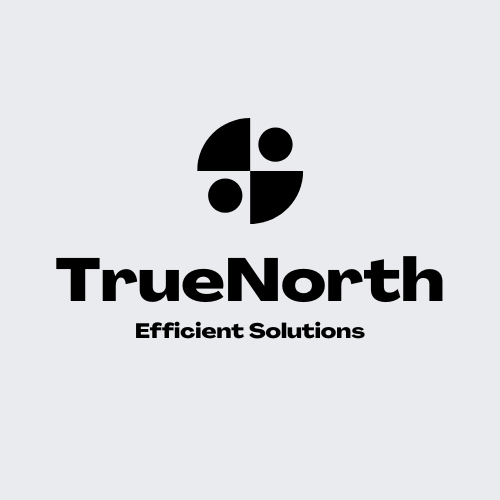

# True North Insights



## Veteran-Led Technology Solutions

True North is a veteran-owned technology company dedicated to delivering exceptional data integrity, compliance, and modernization solutions. We bring military discipline and precision to solve complex technical challenges for government agencies and forward-thinking organizations.

### Our Mission

We're committed to supporting American prosperity, strengthening national security, and modernizing government operations through superior technology solutions while embodying the values of honor, integrity, and excellence in everything we do.

### Core Services

- **Data Integrity Solutions**: Military-grade solutions ensuring data accuracy, consistency, and trustworthiness
- **Regulatory Compliance**: Navigating complex requirements with military discipline and attention to detail
- **Legacy System Modernization**: Transforming outdated systems with strategic precision
- **Security Operations**: Protection of digital assets with military defense system approaches
- **Cloud Solutions**: Secure cloud environments with military logistical operation precision 
- **Custom Application Development**: Mission-critical applications built with military engineering discipline
- **Strategic Technology Consulting**: Technology guidance with military leadership strategic thinking

## Project Overview

This repository contains True North's Angular-based corporate website and customer portal, built using an Nx monorepo architecture. The project showcases True North's services, veteran-focused mission, case studies, and provides resources for veterans transitioning to technology careers.

### Key Features

- Veteran-focused brand identity with patriotic design elements
- Interactive tactical displays and radar visualizations
- Parallax scrolling and animated section transitions
- Military-inspired UI/UX with theme switching capabilities
- Veteran resources and career pathway information

## Technology Stack

- **Framework**: Angular 
- **Monorepo Management**: Nx
- **UI Components**: Angular Material
- **Styling**: SCSS
- **Animations**: Angular Animations
- **Testing**: Playwright for E2E tests
- **Documentation**: Python tools for generating business documents and PDFs

## Development Setup

This project is built using [Nx](https://nx.dev), a set of extensible dev tools for monorepos.

### Prerequisites

- Node.js (LTS version)
- npm or yarn
- Python 3.8+ (for documentation tools)

### Getting Started

1. Clone the repository
2. Install dependencies:
   ```sh
   npm install
   ```
   
3. For documentation tools, install additional dependencies:
   ```sh
   pip install -r python/requirements.txt
   ```

## Run Tasks

To run the dev server for your app, use:

```sh
npx nx serve true-north-insights
```

To create a production bundle:

```sh
npx nx build true-north-insights
```

To see all available targets to run for a project, run:

```sh
npx nx show project true-north-insights
```

These targets are either [inferred automatically](https://nx.dev/concepts/inferred-tasks) or defined in the `project.json` or `package.json` files.

To run E2E tests:

```sh
npx nx e2e true-north-insights-e2e
```

## Documentation Tools

The repository includes Python tools for generating professional business documentation:

- **Business Plan Generator**: Creates a 5-year business plan with charts and visualizations
- **RMF Documentation**: Generates Risk Management Framework documentation
- **PDF Export**: Converts markdown documents to styled PDFs with True North branding

To use these tools:

```sh
# Generate business plan
python python/business_plan.py

# Generate RMF documentation
python python/generate_rmf.py

# Convert markdown to PDFs
python python/export_to_pdf.py python/business_plan.md
```

For more details, see the [Python Tools README](python/README.md).

## Project Structure

The monorepo is organized as follows:

- `apps/true-north-insights/`: Main application code
  - `src/app/components/`: Reusable UI components
  - `src/app/common/`: Shared services and utilities
  - `src/app/sections/`: Main site sections
  - `src/app/business/`: Business logic and data models
  - `src/app/services/`: Core services and data providers
- `apps/true-north-insights-e2e/`: E2E tests using Playwright
- `python/`: Documentation and business tools
  - `business_plan.py`: Business plan generator
  - `generate_rmf.py`: RMF documentation generator
  - `export_to_pdf.py`: Markdown to PDF converter

## Adding New Projects

While you could add new projects to your workspace manually, you might want to leverage [Nx plugins](https://nx.dev/concepts/nx-plugins) and their [code generation](https://nx.dev/features/generate-code) feature.

To generate a new application, use:

```sh
npx nx g @nx/angular:app demo
```

To generate a new library, use:

```sh
npx nx g @nx/angular:lib mylib
```

## DevOps and CI

[Finish setting up your Nx workspace CI](https://cloud.nx.app/connect/soAphlWoGV)

Learn more about [Nx on CI](https://nx.dev/ci/intro/ci-with-nx)

## Recommended Tools

Nx Console is an editor extension that enriches your developer experience. It lets you run tasks, generate code, and improves code autocompletion in your IDE. It is available for VSCode and IntelliJ.

[Install Nx Console](https://nx.dev/getting-started/editor-setup)

## Supporting Veterans

True North is dedicated to supporting veterans transitioning to technology careers. We actively recruit, train, and mentor veterans, providing meaningful career opportunities in software development, cybersecurity, and project management.

## License

Copyright © 2023-2024 True North Insights, LLC. All rights reserved.

## Connect With Us

- Website: [truenorth.tech](https://truenorth.tech)
- Email: info@truenorth.tech
- Phone: 701-555-0100
- Location: Midwest, USA

---

<a alt="Nx logo" href="https://nx.dev" target="_blank" rel="noreferrer"></a>

Built with [Nx](https://nx.dev) - Smart, Fast and Extensible Build System
