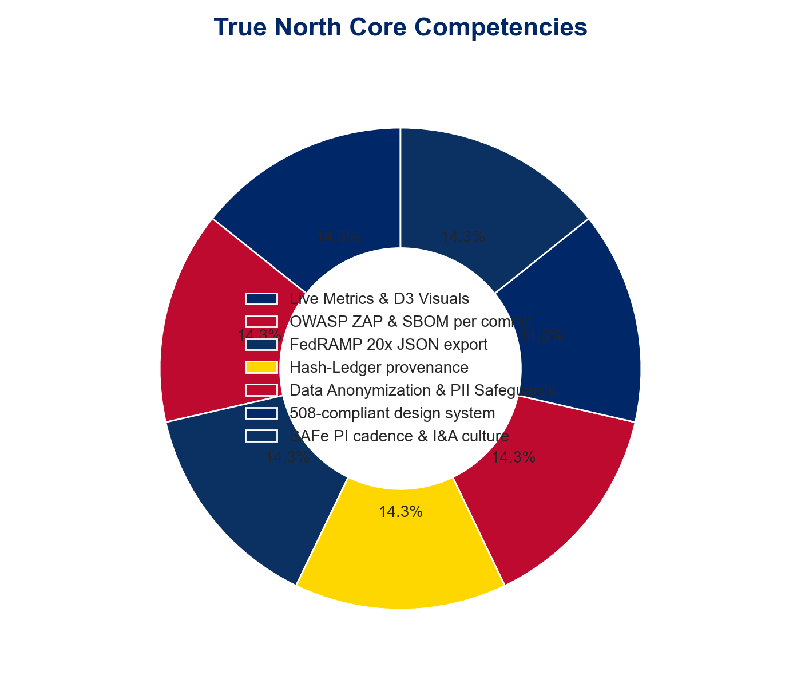
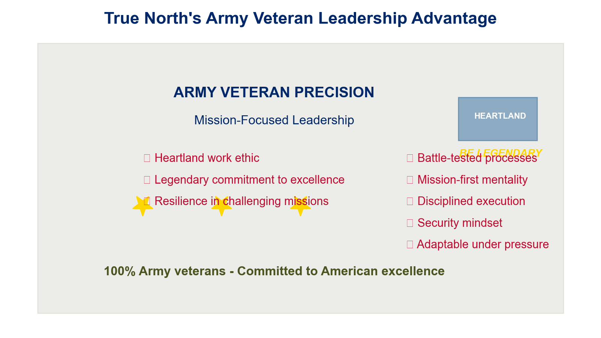
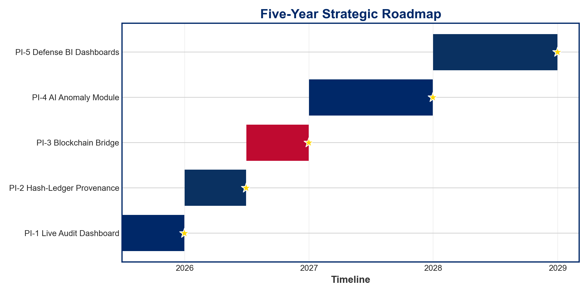
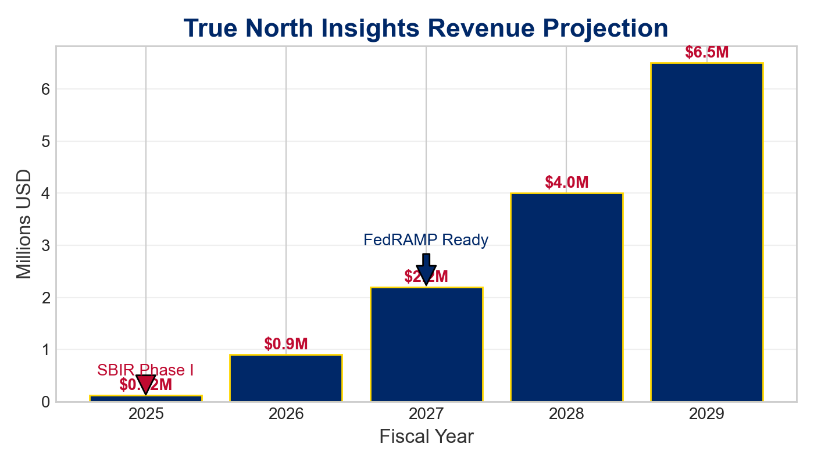
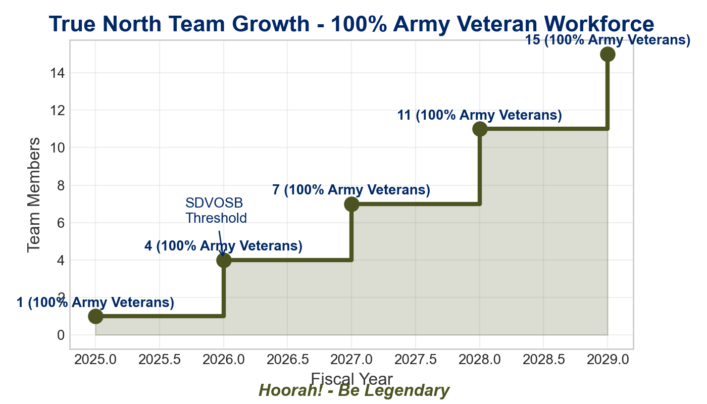
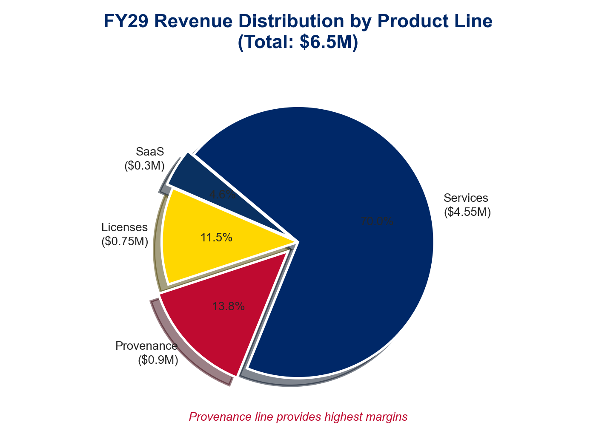
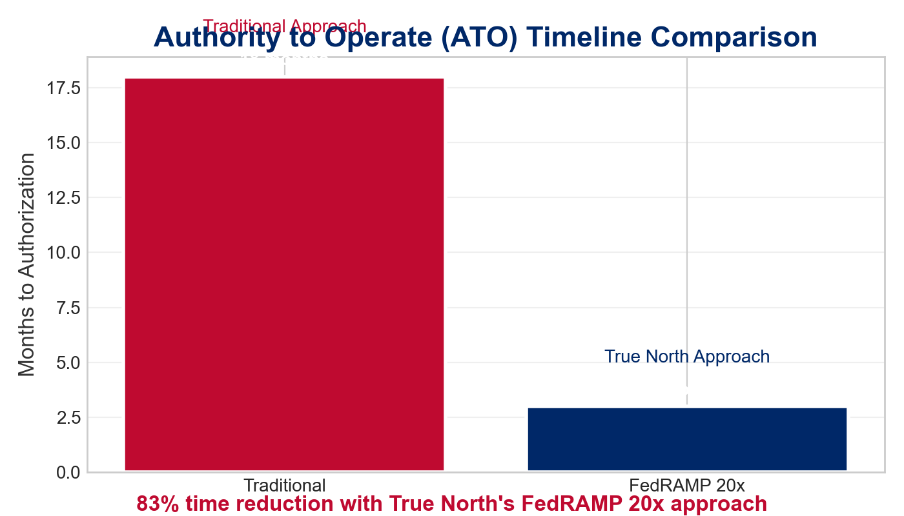
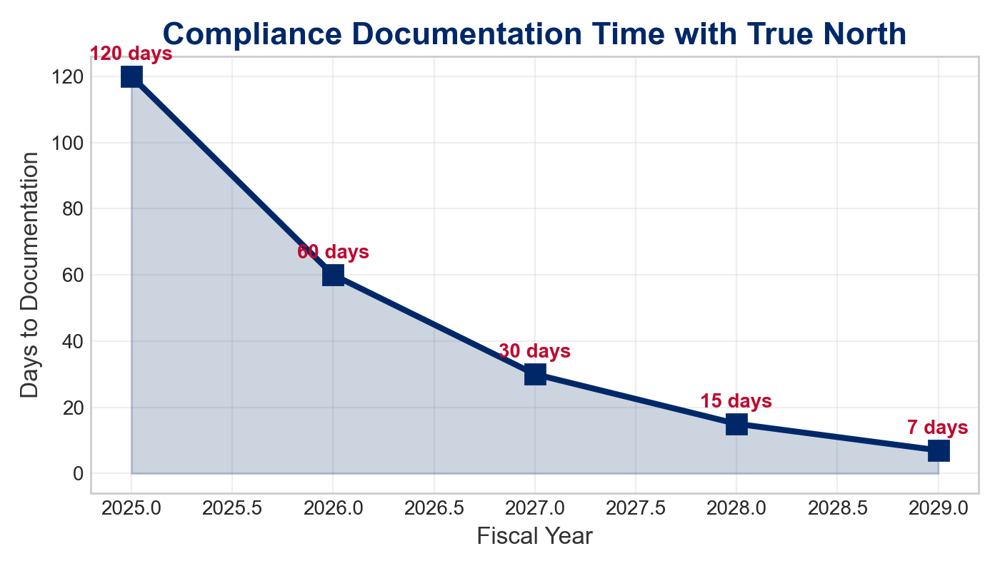
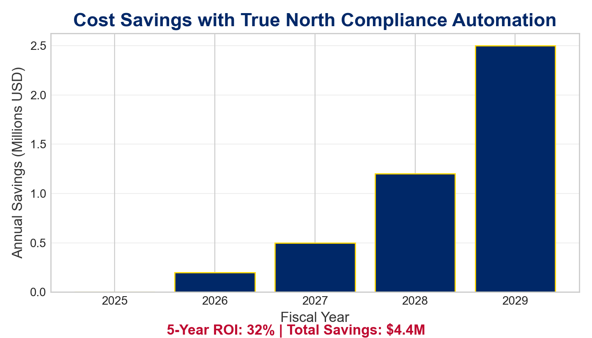
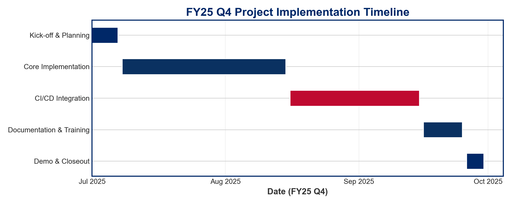

# True North Insights · Five‑Year Capability & Growth Blueprint (FY 25‑29)

<h2>🇺🇸 Veteran-Owned · Remote-First · FedRAMP-Ready 🇺🇸</h2>

## Executive Snapshot

**Problem:** Federal missions delay while waiting months or years for ATOs, costing taxpayers billions.

**Solution:** True North's real‑time compliance dashboards export FedRAMP 20x‑ready evidence with military-grade precision.

**Benefit:** Slashes ATO wait times from 18+ months to approximately 3 months; critical national security missions launch sooner with full compliance.

True North Insights delivers military-grade compliance solutions that accelerate mission delivery for federal agencies. Our veteran-led team brings precision, reliability, and security expertise to government technology challenges.

**MISSION:** To secure America's digital infrastructure with unwavering integrity and veteran-led excellence.

## Core Competencies

**Problem:** Many vendors claim compliance expertise but lack the technical depth and military discipline to deliver.

**Solution:** Six battle-tested capabilities-from real-time WebSocket D3 visualizations to immutable SBOM-per-commit security chains.

**Benefit:** Prime contractors gain an immediately deployable, audit-ready subcontractor with veteran-led security operations.

- **Live Metrics & D3 Visuals (WebSocket)** - Real-time security monitoring with military-inspired tactical displays
- **OWASP ZAP & SBOM per commit** - Continuous security validation with cryptographic supply chain verification
- **FedRAMP 20x JSON evidence export** - Automated compliance documentation ready for accelerated processing
- **Hash-Ledger provenance + optional Hyperledger** - Immutable audit trails with blockchain-level integrity
- **Data Anonymization & PII Safeguards** - Automated masking and privacy controls for sensitive information
- **508-compliant design system** - Accessible interfaces ensuring mission availability for all personnel
- **SAFe PI cadence & I&A culture** - Military-inspired agile development with intelligence and adaptability

## Roadmap (5 Program Increments)

**Problem:** New security technology without disciplined, phased deployment plans fails at pilot stage, wasting resources.

**Solution:** Military-inspired SAFe Program Increment cadence delivers five precisely scheduled, mission-critical capabilities.

**Benefit:** Agency stakeholders gain predictable quarterly progress visibility; funding alignment stays on-target throughout implementation.

| Increment | Deliverable | Outcome |
| - | - | - | - | - | - | - | - | - |
| PI‑1 FY 25 H2 | Live Audit Dashboard | Ends spreadsheet audits; P‑Card friendly |
| PI‑2 FY 26 H1 | Hash‑Ledger Provenance | Every config & log traceable |
| PI‑3 FY 26 H2 | Blockchain Bridge | Immutable chain‑of‑custody |
| PI‑4 FY 27 | AI Anomaly Module | 2 s triage meets zero‑trust SLA |
| PI‑5 FY 28 | Defense BI Dashboards | Force‑readiness & asset tracking |

Each Program Increment follows military-grade planning and execution standards with transparent metrics and accountability.

## Service Portfolio (excerpt)

**Problem:** Government contracting officers face complex procurement obstacles when trying innovative security solutions.

**Solution:** True North's comprehensive service menu spans from Micro‑Purchase threshold engagements to enterprise IDIQ contract add‑ons.

**Benefit:** Agencies can start with low-risk $10K prototypes and scale to enterprise solutions with proven performance and zero procurement friction.

| Engagement | Vehicle / Ceiling | Deliverables | Outcome |
| - | - | - | - | - | - | - | - | - | - | - | - |
| Prototype Audit Dashboard | Micro‑Purchase ≤ $10 K | 5‑widget dashboard; FedRAMP JSON | Instant insight |
| Pilot Audit‑as‑a‑Service | SAP ≤ $250 K | Full‑stack + ZAP/SBOM | Cuts prep 40 % |
| SaaS License Pack | GSA MAS $30 K/yr | Multi‑tenant dashboards | Always‑on compliance |
| Provenance Ledger Add‑On | IDIQ $150 K | Hash‑ledger + Hyperledger | Immutable custody |
| Zero‑Trust Architecture | OTA $250-500 K | NIST 800-207 blueprint; ZTA KPI dashboard | Accelerates zero-trust adoption |

All services delivered with veteran-led teams bringing military precision and unwavering integrity to every engagement.

## Five‑Year Financial Trajectory

**Problem:** Inaccurate growth projections ignore small‑business ceiling complications and create teaming agreement risks.

**Solution:** True North's precision financial model maintains revenue under small business thresholds through FY27 with controlled scaling.

**Benefit:** Prime contractors can confidently team without risking size standard complications while enabling veteran-focused growth.

| FY | Drivers | Revenue (M) |
| - | - | - | - | - | - | - | - | - |
| 2025 | 12 micro‑purchases | 0.12 |
| 2026 | 24 micro + 1 pilot | 0.90 |
| 2027 | 3 dashboards + SaaS prep | 2.20 |
| 2028 | SaaS + 3 licenses | 4.00 |
| 2029 | Provenance + seats | 6.50 |

## FedRAMP 20x Impact

**Problem:** Manual security compliance processes and paper-based evidence packages create massive authorization backlogs.

**Solution:** True North's tactical dashboards continuously emit OSCAL JSON evidence compatible with FedRAMP 20x automated processing.

**Benefit:** Revolutionary improvement cuts Moderate Authority to Operate timeline by approximately 83%, enabling faster mission execution.

The FedRAMP 20x initiative modernizes cloud service authorization through automation. True North's solutions are specifically designed to integrate with this process, providing machine-readable OSCAL documentation that dramatically accelerates authorization timelines.

## Security Metrics Impact

**Problem:** Organizations struggle to demonstrate security ROI with traditional compliance approaches.

**Solution:** True North's continuous monitoring provides real-time security improvement metrics tied to mission outcomes.

**Benefit:** Leadership gains quantifiable evidence of security posture improvement and clear financial return on security investment.

True North's approach delivers quantifiable security improvements and measurable return on investment. Our military-precision metrics provide leadership with the insight needed to make informed security decisions and demonstrate tangible value to stakeholders.

## Veteran Leadership Advantage

**Problem:** Technical teams often lack the disciplined leadership needed for high-stakes security implementations.

**Solution:** True North brings legendary work ethic and military precision to every engagement with battle-tested processes.

**Benefit:** Agencies gain the proven reliability of America's heartland veterans who understand both the mission and the technology at stake.

True North Insights is proudly 100% Army veteran-owned and operated, bringing military discipline and legendary work ethic to government technology solutions. Our leadership team includes veterans who embody the 'Be Legendary' spirit in every engagement with federal agencies.

**Core Values:**
- **Integrity:** Unwavering commitment to truth and ethical standards
- **Excellence:** Military-grade precision with heartland reliability
- **Service:** Putting mission and country first
- **Innovation:** American ingenuity solving complex challenges

**"Hoorah! We bring legendary commitment to your technology mission."**

## FY25 Q4 Project Implementation

**Problem:** New programs struggle with first-time implementation and establishing trust with stakeholders.

**Solution:** True North provides a clear, predictable delivery timeline with defined milestones and military precision.

**Benefit:** Clients receive transparent progress tracking and early confidence in delivery capabilities.

Our first micro-purchase project delivers a **FedRAMP 20x JSON Export Proof-of-Concept** with the following phases:

| Timeframe | Phase | Deliverables |
| - | - | - | - | - | - | - | - | - |
| July 1-7, 2025 | Kick-off & Planning | Charter; schema documentation |
| July 8 - Aug 15, 2025 | Core Implementation | Working script + Angular component |
| Aug 16 - Sep 15, 2025 | CI/CD Integration | GitLab CI jobs; validation reports |
| Sep 16-25, 2025 | Documentation & Training | README; OpenAPI spec; training |
| Sep 26-30, 2025 | Demo & Closeout | Stakeholder demo; feedback capture |

This initial project serves as a foundation for future engagements and demonstrates our military-precision delivery capabilities.

## Go-to-Market Strategy

**Problem:** Innovative security startups struggle to establish credibility and access federal contract vehicles.

**Solution:** True North employs a phased approach leveraging veteran networks and legendary business ethic for precise channel targeting.

**Benefit:** Low-risk entry points for clients and predictable growth for True North's veteran-led team from America's heartland.

True North's go-to-market approach leverages our veteran network and legendary business ethic:

- **Anchor Pilots:** Strategic pilots with defense agencies (micro-purchases)
- **Thought Leadership:** "Road to Immutable Audit" blog series & Bunker Labs program
- **Delivery Cadence:** Quarterly PI Planning with Inspect-&-Adapt cycles every 8-12 weeks
- **Veteran Network:** Leveraging connections from military service for introductions to prime contractors
- **Strategic Location:** Midwest headquarters provides additional contracting advantages
- **Legendary Advantage:** Bringing "Be Legendary" work ethic to every federal engagement

Our approach exemplifies heartland values: starting small, proving our worth through honest work, and growing based on earned trust and proven performance.

---

<strong>True North Insights, LLC</strong> | Proud to serve America's technology needs

<strong>Contact:</strong> jeffreysanford@gmail.com | <strong>Website:</strong> www.truenorthinsights.com

