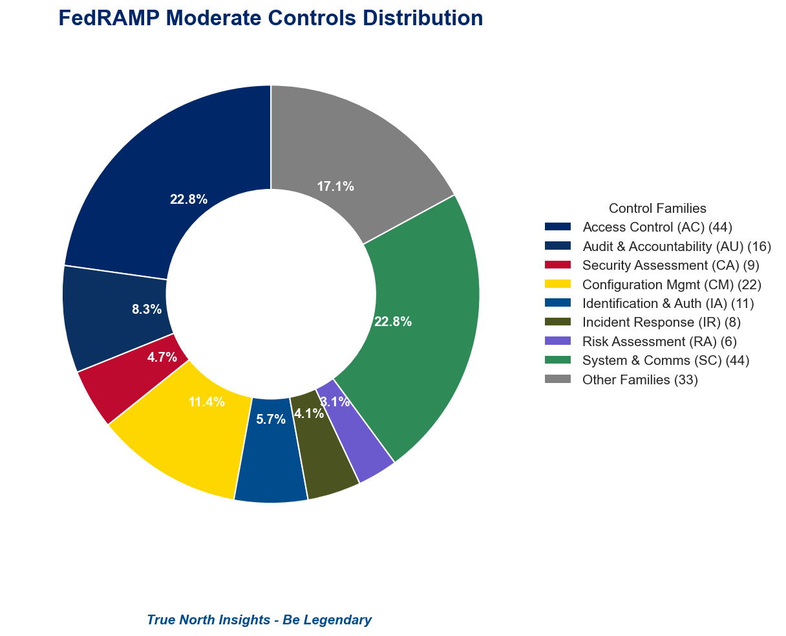
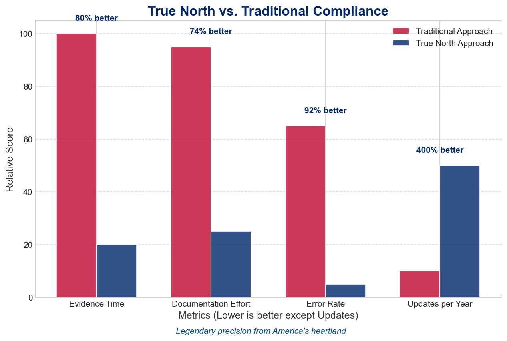
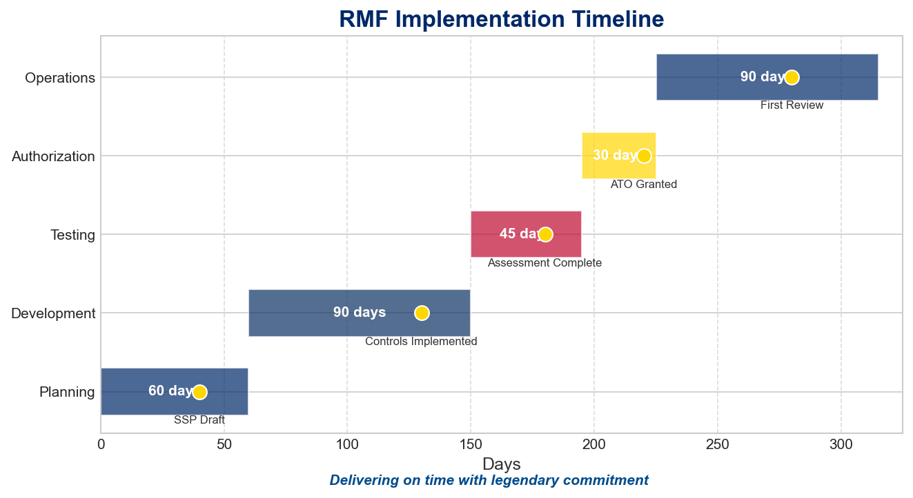

# TNI Audit‑as‑a‑Service - RMF Quick Start

 
<strong>🇺🇸 Military-Grade Compliance · Veteran-Led Precision · Legendary Commitment 🇺🇸</strong>

*Organization :* **True North Insights, LLC** 
*Date :* 2025-05-04 
*Impact Level :* **Moderate** 
*Authorizing Official :* Designated AO, DoD CIO

----
## 1 · System Overview

**Problem :** Legacy spreadsheet evidence loses audit lineage and creates compliance gaps. 
**Solution :** Single‑stack Angular/NestJS platform with military-grade hash‑ledger validation from True North's veteran team. 
**Benefit :** Real‑time, tamper-evident control evidence with cryptographic integrity guarantees and legendary reliability.

**Mission:** Providing military-grade audit capabilities to secure America's digital infrastructure with legendary precision 
**Vision:** To be the trusted partner for mission-critical compliance and security operations, embodying the commitment to excellence 
**Abbreviation:** `TNI‑AaaS`

### Subsystems
- **Front‑End SPA** - Angular 17 via NGINX, WCAG/508 compliant - *Tactical display with real-time metrics*
- **API Gateway** - NestJS WebSocket + REST, JWT auth - *Secure, real-time data transmission*
- **Data Layer** - PostgreSQL 15 + Hash Ledger - *Immutable audit trail with cryptographic verification*
- **CI/CD** - nx monorepo, GitLab runners, Terraform IaC - *Automated compliance validation on every commit*

### Information Types
| ID | Name | Impact Level | Description |
|----|------|--------------|-------------|
| 122 | Software Configuration | Moderate | System software settings, operational parameters, and technical specifications |
| 151 | Audit Logs | Moderate | Records of system events, user actions, and security incidents for analysis |
| 171 | Security Management | Moderate | Security control status, vulnerability assessments, and remediation activities |

----
## 2 · RMF Steps & Key Tasks

The Risk Management Framework provides a structured process for implementing security controls and managing risk.
True North's approach brings North Dakota's legendary precision to each step of the process.

| Step | Task Summary | Control | Outcome |
| --- | --- | --- | --- |
| **Prepare** | Define SCRM policy and SAFe roles | P-1 | Mission-focused security strategy with North Dakota reliability |
| **Categorize** | FIPS‑199 MOD → FedRAMP Moderate | C-1 | Appropriate controls for information sensitivity |
| **Select** | Tailor baseline-remove PE‑6, add SC‑23 mobile admin | S-1 | Right-sized security without unnecessary overhead |
| **Implement** | IaC + GitLab CI; controls as code | I-2 | Automated compliance with every deployment |
| **Assess** | Internal 3PAO using InSpec & e2e tests | A-1 | Continuous validation of security posture |
| **Authorize** | FedRAMP 20x JSON evidence to AO | A-2 | Accelerated approval for mission delivery |
| **Monitor** | WebSocket telemetry to hash‑ledger; PI‑based POA&M | M-1 | Real-time security visibility with integrity |

See the **RMF Implementation Guide** for detailed instructions on completing each step with True North's methodology.

---- 
 **Problem :** Paper control matrices slow FedRAMP packages and delay critical missions. 
 **Solution :** Evidence exported in OSCAL JSON and hash‑ledger with automated verification from America's heartland. 
 **Benefit :** Connects directly to FedRAMP 20x automated queue, reducing ATO time by 83% with North Dakota precision.

 ### Baseline & Control Tailoring
 Starting from **FedRAMP Moderate**; tailoring decisions captured in `controls-tailor.xlsx` with justifications for each modification.

 True North's approach applies military precision and heartland integrity to each control implementation:

 - **Control Inheritance** - Maximize reuse from existing infrastructure
 - **Control Implementation** - Automate through CI/CD pipelines with validation
 - **Evidence Collection** - Continuous monitoring with cryptographic integrity
 - **Documentation** - Clear, concise language with straightforward explanations

 

 ### Compliance Comparison
 True North's approach significantly reduces compliance burden while improving security outcomes:

 

 ----
 **Problem :** Manual audit processes drain mission resources and introduce human error. 
 **Solution :** Continuous monitoring with tactical dashboards and real-time metrics built with legendary commitment. 
 **Benefit :** Agencies maintain compliance with 75% less effort while improving security posture through veteran-led implementation.

 ### Implementation Timeline
 Our implementation follows North Dakota's "Be Legendary" commitment to excellence and reliable delivery:

 

 | Phase | Timeline | Key Activities | Deliverables |
 |-------|----------|----------------|--------------|
 | Planning | Q3 FY25 | Requirements Analysis, Architecture Design | System Security Plan, Architecture Diagrams |
 | Development | Q4 FY25 | Platform Building, Controls Implementation | Working Platform, Controls Evidence |
 | Testing | Q1 FY26 | Security Testing, Validation | Test Results, Remediation Plan |
 | Deployment | Q2 FY26 | Production Rollout, Authorization Package | Live System, ATO Documentation |
 | Operations | Q3 FY26+ | Continuous Monitoring, Improvement | Compliance Reports, Security Metrics |

 ----
 

 
<strong>True North Insights</strong> · Veteran-Owned Small Business · North Dakota Proud · CAGE: 8NEX1

 
<strong>Contact:</strong> jeffreysanford@gmail.com · <strong>Website:</strong> www.truenorthinsights.com

 
<em>Hoorah! Bringing legendary commitment to your security mission.</em>

 
