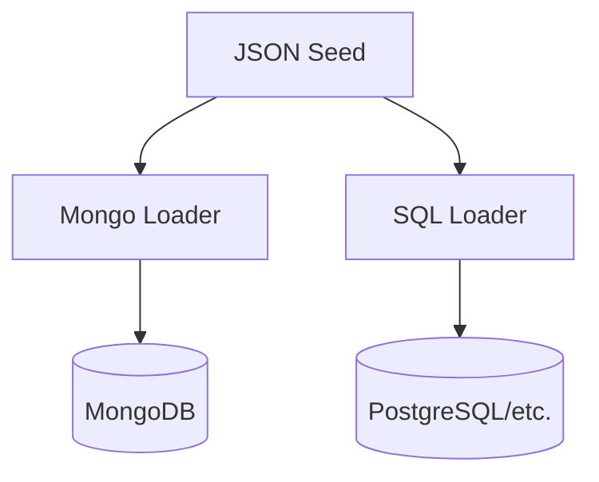

# Demo Seed Data — One Source for Mongo & SQL

## Goal
Feed **both** MongoDB and SQL from the same JSON seed to prove dual‑persistence capability.

## Seed Shape
```json
{
  "tenants": [{ "id": "t1", "name": "Demo", "createdAt": "2025-10-01T00:00:00Z" }],
  "users": [{ "id": "u1", "tenantId": "t1", "displayName": "Demo User", "email": "demo@tni.us", "roles": ["admin"], "createdAt": "2025-10-01T00:00:00Z" }],
  "boards": [{ "id": "b1", "tenantId": "t1", "name": "Demo Board" }],
  "cards": [{ "id": "c1", "boardId": "b1", "title": "First Card", "status": "doing", "assignees": ["u1"] }],
  "timeEntries": [{ "id": "te1", "tenantId": "t1", "cardId": "c1", "userId": "u1", "date": "2025-10-01", "minutes": 60, "note": "Kickoff", "createdAt": "2025-10-01T00:00:00Z", "createdBy": "u1" }]
}
```

## Loader Strategy


## Example Loaders (pseudo)
```ts
// apps/backend/src/seed/load-mongo.ts
export async function loadMongo(seed: Seed) {
  await TenantModel.insertMany(seed.tenants);
  await UserModel.insertMany(seed.users);
  await BoardModel.insertMany(seed.boards);
  await CardModel.insertMany(seed.cards);
  await TimeEntryModel.insertMany(seed.timeEntries);
}
```

```ts
// apps/backend/src/seed/load-sql.ts
export async function loadSql(seed: Seed, ds: DataSource) {
  await ds.getRepository(TenantEntity).save(seed.tenants);
  await ds.getRepository(UserEntity).save(seed.users);
  await ds.getRepository(BoardEntity).save(seed.boards);
  await ds.getRepository(CardEntity).save(seed.cards);
  await ds.getRepository(TimeEntryEntity).save(seed.timeEntries);
}
```
