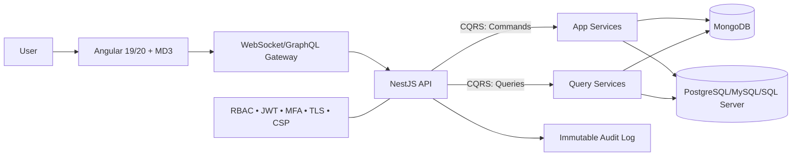

# Architecture — Dual Persistence (MongoDB + SQL)

## High‑Level

- **Why dual persistence?** Demonstrates mastery of both **document** and **relational** paradigms while keeping a single domain model (DTOs) and validation layer.
- **Pattern:** **CQRS‑inspired** split between command/write and query/read with repository interfaces hiding storage details.
- **Tenancy:** Start with single‑DB per environment; support multi‑tenant later via tenantId column/field or DB‑per‑tenant.

## Key Principles
- **Single Source DTOs** shared in `libs/shared/api-interfaces`.
- **Repositories** implement both **Mongoose** and **TypeORM** backends.
- **Audit trail** receives normalized events regardless of backing store.
