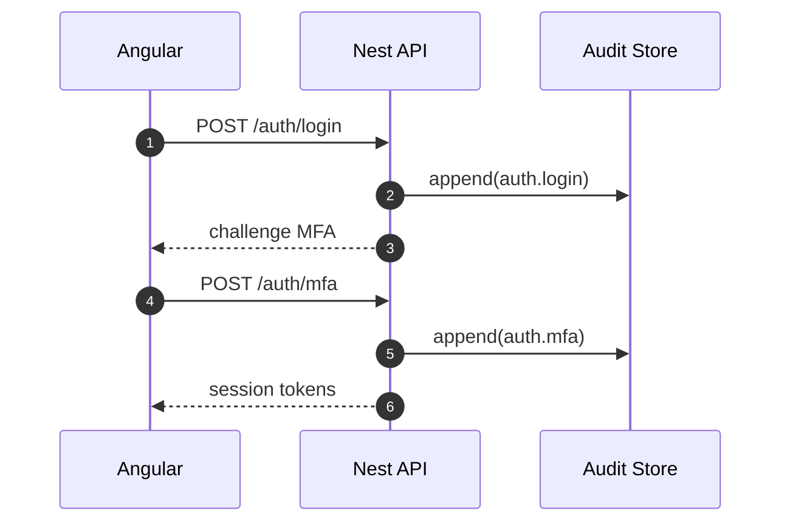

# Security & Audit — Trust by Design

## Controls
- **MFA by default** for all accounts; TOTP initially.
- **RBAC:** `owner | admin | analyst | viewer | auditor` (least privilege).
- **JWT** short‑lived access + refresh rotation; IP/device claims optional.
- **Transport:** TLS 1.3; HSTS; strict CSP; cookie `HttpOnly; Secure; SameSite=Lax`.
- **Data at Rest:** full‑disk or tablespace encryption (SQL) + encrypted Mongo volumes.
- **Audit Trail:** append‑only collection/table. Redact PII in payloads.

## Events Covered
- `auth.login`, `auth.mfa`, `auth.logout`
- `rbac.role.add/remove`
- `time.create/update/delete`, `card.create/update`
- `config.update`, `export.create`

