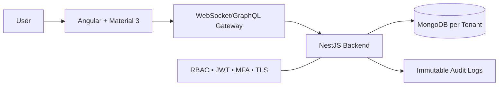

# True North Insights — Website Architecture

## High-Level Architecture

- **Frontend:** Angular 19/20 + MD3
- **Backend:** NestJS (Node.js) + GraphQL/REST
- **Database:** MongoDB (multi-tenant capable)
- **Security:** JWT, MFA, TLS, RBAC
- **Deployment:** NX monorepo, PM2 + Nginx
