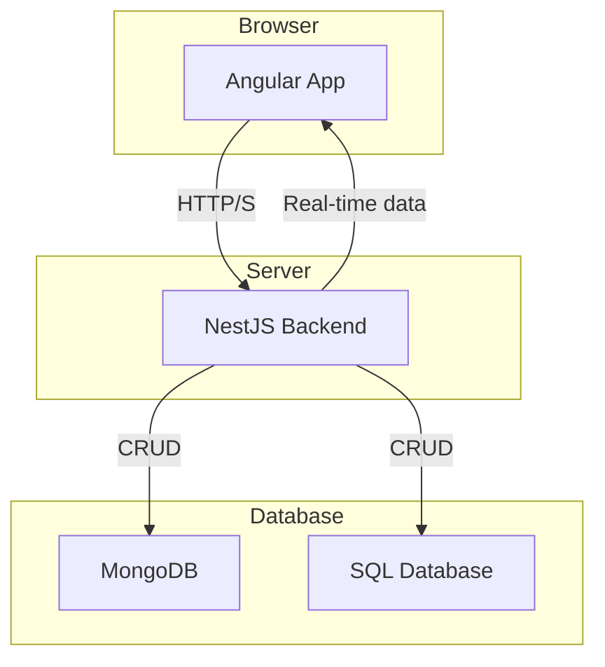

# True North Insights — Component Inventory

## Angular + Material Design 3 Components

- **Layout:** App Shell, Header, Footer, Sidebar
- **Pages:** Home, About, Services, Contact, Development, Project
- **Features:** Swagger UI, Project (Table + Kanban), Real-time Dashboard (seed / placeholder)
- **Shared:** Not Found, Toaster

### Project Feature

| Aspect | Implementation |
|--------|----------------|
| Data Source | Static JSON seed (`time-tracking-seed.json`) via `ProjectDataService` |
| Table View | Angular Material `<table mat-table>` with typed columns |
| Kanban View | Three CDK drop lists (Past, Present, Future) deriving task buckets by date fields |
| State Pattern | Initial BehaviorSubject prototype simplified to direct subscription + local arrays (avoids excessive change detection + template async) |
| Drag & Drop | `CdkDragDrop` with immutable array moves (reinsert/remove) |
| Navigation | Header & Sidebar link `Project` (replacing legacy Blog) |

Guiding Principle: complex multi-pane UIs consolidate state mutation in the component/service and present plain template bindings—favor clarity and predictable change detection over pervasive async pipes.

## Example Component Flow

