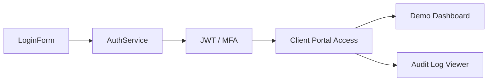

# True North Insights — Component Inventory

## Angular + Material Design 3 Components
- **Layout:** AppShell, TopNav, SideNav (portal)
- **Auth:** SignInForm, SignUpForm, MfaSetup, PasswordReset
- **Marketing:** HeroBanner, PillarsGrid, CaseStudyTile, LogoStrip
- **Portal:** BoardView, MetricsTile, AuditTable, UserMenu

## Example Component Flow

