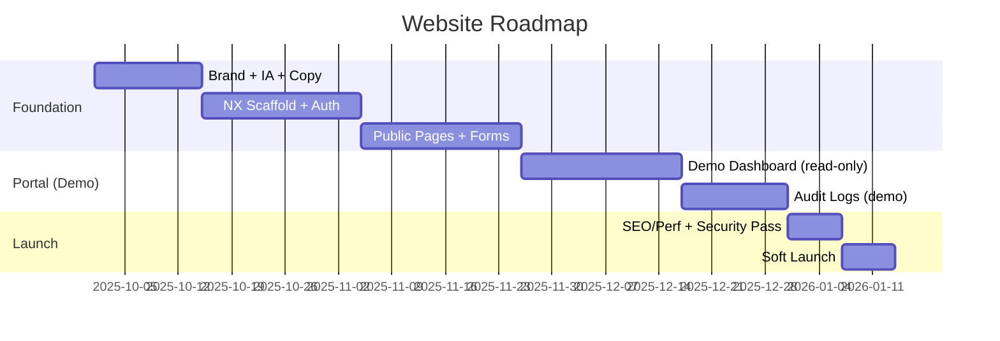

# True North Insights — Website Roadmap

## Phased Development Plan

## Acceptance Criteria
- Public site live with marketing + contact flow
- Auth enabled with MFA
- Portal demo dashboard available
- Audit logs visible with seeded events
- Capability Statement PDF downloadable
- Accessibility + Performance: Lighthouse ≥ 90, WCAG AA
