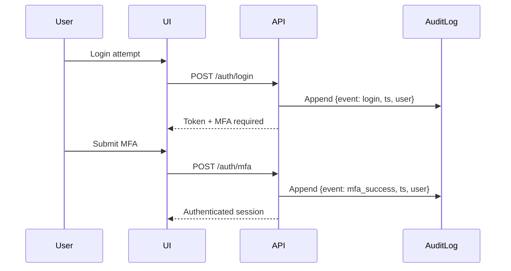

# True North Insights — Security Design

## Security Model
- **Authentication:** Email + Password, MFA (TOTP initially)
- **Authorization:** RBAC (`owner`, `admin`, `analyst`, `viewer`, `auditor`)
- **Audit Logging:** Append-only; all actions logged (auth, RBAC, data, settings)
- **Data Protection:** TLS 1.3, Encrypted at Rest, Strict CSP, HttpOnly cookies

## Audit Trail Coverage

## Compliance Targets
- Section 508 / WCAG 2.2 AA
- FedRAMP Moderate-aligned architecture
