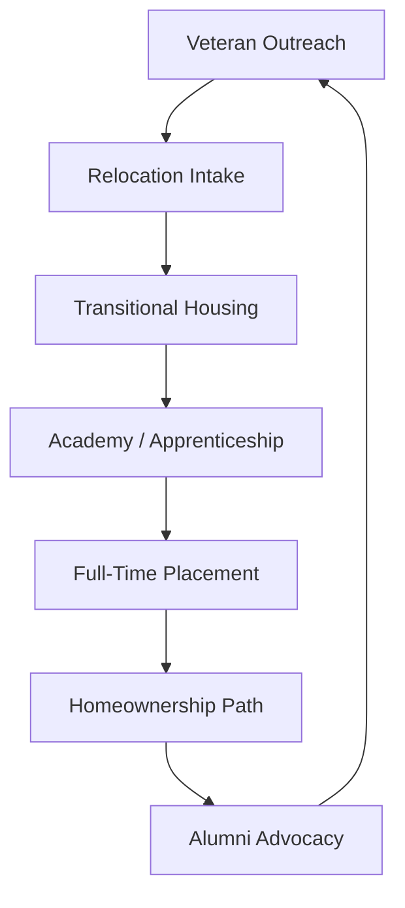
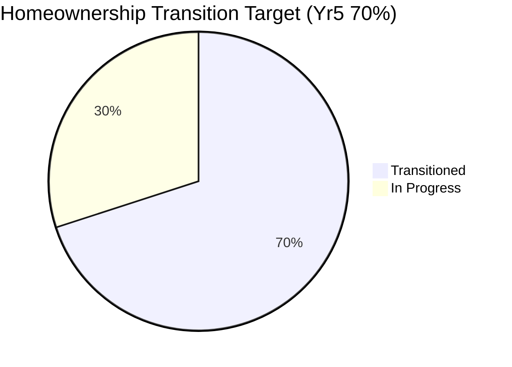

# Move to Jamestown Veteran Relocation Accelerator (Market / Grant Variant)

Status: Draft v0.1  
Last Updated: 2025-10-03

Canonical Source: `documentation/marketing/move-to-jamestown-veterans.md`

---

## 1. Executive Abstract

A veteran-focused rural revitalization and workforce acceleration program centered in Jamestown, North Dakota. The accelerator fuses employment, transitional housing, and deep civic integration to create a repeatable blueprint for stabilizing and scaling a mission-aligned technical workforce serving federal, state, and community innovation needs.

## 2. Strategic Thesis

- Veterans possess disciplined execution capacity under-leveraged in analytics & real-time systems.
- Rural hubs can attract and retain talent when bundled with structured housing + community mission identity.
- A place-based pipeline (Jamestown) + capability engine (True North Insights) + civic partners = durable social & economic impact.

## 3. Core Pillars

| Pillar                  | Description                                 | Primary Outcome                 |
| ----------------------- | ------------------------------------------- | ------------------------------- |
| Workforce Acceleration  | Talent Track + structured apprenticeship    | High-signal delivery capacity   |
| Housing Stability       | Transitional → rental → ownership glidepath | Retention & household anchoring |
| Civic Integration       | Fraternal + university + service org mesh   | Belonging & referral loop       |
| Economic Revitalization | Increased skilled household presence        | Local spending & growth         |
| Impact Transparency     | KPIs & public impact briefs                 | Fundability & trust             |

## 4. Program Flow (Visual)

## 5. Market Positioning Snapshot

| Dimension          | Traditional Remote Vendor | Jamestown Accelerator Model           |
| ------------------ | ------------------------- | ------------------------------------- |
| Workforce Identity | Generic / blended         | Veteran-centric (measured)            |
| Place Strategy     | Distributed / diffuse     | Place-anchored (Jamestown hub)        |
| Housing Component  | None                      | Structured transitional support       |
| Civic Capital      | Minimal                   | Fraternal + academic + service layers |
| Accountability     | Ad hoc metrics            | Transparent milestone & KPI reporting |

## 6. Impact & KPI Framework

| KPI                        | Year 1   | Year 3 | Year 5 | Source            |
| -------------------------- | -------- | ------ | ------ | ----------------- |
| Veterans Relocated         | 10       | 50     | 150    | Intake Ledger     |
| Employment ≤90 Days        | 80%      | 85%    | 90%    | HR Placement      |
| Homeownership Transition % | 20%      | 45%    | 70%    | Housing Partners  |
| Local Retention (5 yr)     | 70%      | 80%    | 85%    | Longitudinal File |
| Community Partnerships     | 3        | 6      | 10+    | MOU Register      |
| Alumni Referral Rate       | Baseline | 15%    | 25%    | CRM Analytics     |

## 7. Funding & Leverage Model

| Stream                    | Mechanism                     | Use of Funds            |
| ------------------------- | ----------------------------- | ----------------------- |
| State Workforce Grants    | ND Commerce proposals         | Stipends & training ops |
| Federal Workforce / DoL   | Competitive grant cycles      | Scaling cohorts         |
| Local Development Corp    | Matching contributions        | Housing bridge fund     |
| Philanthropic / Civic     | Sponsorship tiers             | Events & integration    |
| Operating Margin Reinvest | Percentage of delivery margin | Sustainability reserve  |
| Employer Consortium       | Placement fee or cost-share   | Curriculum + mentorship |

## 8. Housing Glidepath Detail

| Phase         | Duration | Asset Type                     | Support Overlay            |
| ------------- | -------- | ------------------------------ | -------------------------- |
| Transitional  | 0–3 mo   | Furnished cluster / dorm style | Intake concierge           |
| Stabilization | 3–12 mo  | Discounted rental (MOU)        | Financial literacy intro   |
| Equity Build  | 6–24 mo  | Market rental / savings plan   | Loan prep coaching         |
| Ownership     | 12–36 mo | Single-family / townhouse      | VA + state incentive stack |

## 9. Partnership Matrix (Abbrev.)

| Segment            | Sample Partners                       | Value Injected                 |
| ------------------ | ------------------------------------- | ------------------------------ |
| Civic / Fraternal  | Legion, VFW, Elks, Rotary             | Social lattice & retention     |
| Academic           | UND, NDSU, Univ. Jamestown            | Capstones + continuing ed      |
| Housing / Finance  | Local devs, banks, ND Housing Finance | Supply + financed pathways     |
| Mission Response   | Team Rubicon                          | Applied scenario projects      |
| Employers / Primes | ND tech & defense firms               | Placement + backlog continuity |

## 10. Risk & Mitigation Summary

| Risk                     | Likelihood | Impact | Mitigation                               |
| ------------------------ | ---------- | ------ | ---------------------------------------- |
| Housing Inventory Lag    | Med        | High   | Early MoUs + phased cohorts              |
| Funding Gap (Yr2)        | Med        | High   | Diversify grants + margin reinvest       |
| Retention Dip Post-Year1 | Low/Med    | Med    | Mentorship + alumni advocacy loop        |
| Cohort Skill Variance    | Med        | Med    | Structured assessment + adaptive modules |
| Partner Fatigue          | Low        | Med    | Rotational engagement calendar           |

## 11. Reporting & Transparency Layer

- Quarterly KPI & impact brief (public-facing summary)
- Annual socio-economic impact whitepaper
- Dashboard (internal) mapping cohort progression & outcomes
- Data governance: privacy + de-identification where published

## 12. Integration Hooks

| Artifact                    | Hook Type                          | Purpose                       |
| --------------------------- | ---------------------------------- | ----------------------------- |
| Go-To-Market Playbook       | Program reference                  | Brand & differentiation       |
| Design Backlog              | DX-6 / DX-14 inputs                | Outreach assets & infographic |
| Security & Auditing Backlog | Governance future state            | Trust posture                 |
| Capability Statement        | Location-based differentiator      | Federal / prime positioning   |
| Veteran Talent Track        | Source of curriculum & progression | Workforce maturity            |

## 13. Next 90-Day Action Slice

| #   | Action                                    | Owner        | ETA      |
| --- | ----------------------------------------- | ------------ | -------- |
| 1   | Secure preliminary housing partner MoUs   | Program Lead | Nov 2025 |
| 2   | Draft intake form & data fields           | Talent Ops   | Nov 2025 |
| 3   | Apply for ND Commerce workforce grant     | Grants Team  | Dec 2025 |
| 4   | Build KPI baseline dashboard skeleton     | Data Eng     | Dec 2025 |
| 5   | Publish public-facing overview page (web) | Marketing    | Jan 2026 |

## 14. Differentiation Callout (Summary)

Place-based + veteran-centric + housing-supported pipeline outperforms generic remote staffing in retention, trust capital, and community economic uplift.

## 15. Amendment & Versioning

Revisions tracked via repository history. Major version bump when: new funding structure, geographic expansion, or >25% KPI target shift.

---

> Draft – Market / grant variant. For canonical operational detail see `move-to-jamestown-veterans.md`.
