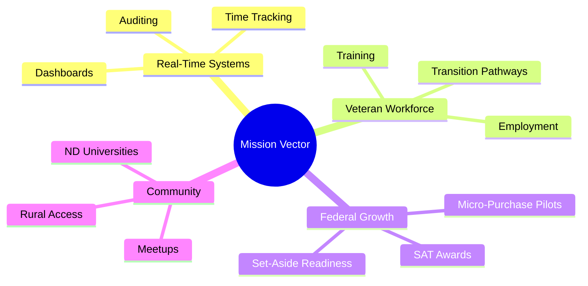
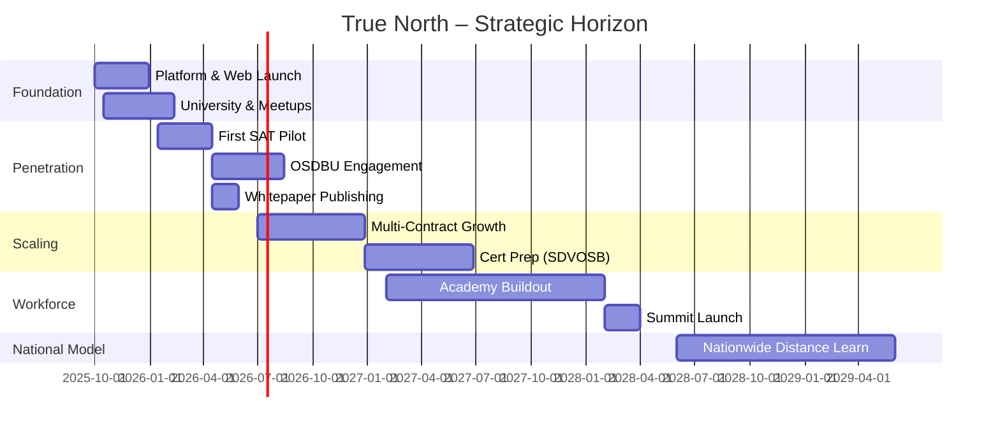

# True North Insights – Expanded 5-Year Plan

## Page 1 – Executive Summary (Expanded)

### Who We Are

True North Insights is more than a veteran-led consulting company; we are a movement rooted in Jamestown, North Dakota. Founded by veterans and patriots, we combine cutting-edge technology with the values of discipline, service, and accountability. Our mission is simple yet powerful: **We are legendary** — building secure, innovative, real-time solutions that strengthen government, empower veterans, and uplift local communities.

Brand Architecture: Company = True North Insights (parent). Public website/campaign shorthand = "True North Insight".

### Core Value Proposition

- **Veteran employment focus:** Targeting 90% veteran employment, creating a sustainable transition pathway into technology careers.
- **Specialists in real-time systems:** Dashboards, auditing, and time/accountability platforms built with Angular + NestJS + RxJS hot observables.
- **Agile federal delivery:** Positioned to win micro-purchases (≤ $15k) and Simplified Acquisition Threshold contracts (< $250k) where speed and clarity win, with complete-delivery MVP packages and a client Planning View for transparent execution.
- **Community-driven impact:** Anchored in North Dakota universities, meetups, and veteran networks – multiplying economic and social resilience.

---

## Page 2 – Market Analysis (Expanded)

### Federal Opportunity Landscape

- **Micro-purchase & SAT contracts:** Agencies urgently need modernization pilots under $250k. These are testbed projects where a veteran-led team with a finished MVP can win quickly.
- **Set-aside pathways (SDVOSB, VOSB, 8(a)):** Future certifications open multimillion-dollar sole-source channels. Until then, subcontracting via primes with inclusion mandates accelerates traction.
- **Veteran transition narrative:** Branding as a pipeline of trained veteran developers positions True North as both a vendor and workforce development partner.

### Target Agencies

- **USACE / DoD:** Modernization dashboards, supply chain visibility, operational readiness.
- **VA / HHS:** Real-time auditing, compliance systems, workforce training integration.
- **OMB / GAO:** Accountability dashboards for government performance oversight.
- **DHS / FEMA:** Incident response & rapid visualization platforms.

### Competitive Advantage

- We do not simply bill hours — **we deliver finished, veteran-built MVPs**.
- Patriotic accountability brand resonates with federal mission owners.
- North Dakota roots = small, approachable, dependable ("North Dakota Nice").
- Unique dual mission: build software AND train veterans into the federal tech workforce.

---

## Page 3 – Capabilities & Offerings (Expanded)

### Core Platforms

- **Forge-Board:** A Kanban + metrics platform aligned to SAFe/Agile, powered by real-time observables; leadership sees live progress instead of static weekly snapshots.
- **Time-Forge:** Time tracking + accountability engine feeding directly into compliance and performance dashboards; AI-ready formats.
- **Blockchain Auditing MVP:** Proved within True North Apparel – real-time, tamper-proof event auditing ready to extend into regulated domains.

### Technology Stack

- Angular 19/20 + Material Design 3 expressive UI.
- Enterprise NgModule architecture (no standalone component sprawl).
- RxJS hot observable patterns for constant data freshness.
- Backend services in NestJS (primary), with emerging Go and Rust microservices.
- Planned dual persistence: MongoDB + PostgreSQL.
- Local-first deployments (Nginx + PM2) with FedRAMP-aligned practices in roadmap.

### Service Model

- **30–90 day fixed-price MVP deployments** with transparent scope control and a standard Planning View (Kanban/table) shared with clients.
- White-label dashboards agencies can internalize and extend.
- Direct SAT awards + subcontract augmentation for primes needing fast modernization deliverables.
- Future: Training-as-a-service; agencies sponsor veteran cohorts mastering True North platforms.

---

## Page 4 – Marketing & Outreach Strategy (Expanded)

### Brand Positioning

**"Legendary Solutions. Veteran Built. Real-Time Ready."**
A promise that every artifact reflects discipline, trust, and velocity.

### Channels

1. **Website:** Patriotic-modern design, clickable demos (Forge-Board / Time-Forge), Veteran Employment page: "Hire Us, Hire Vets", university & community partnerships.
2. **OSDBU Engagement:** Aggressive small business office outreach; tailored capability briefs per agency (USACE, VA, DHS, OMB).
3. **Prime Contractor Outreach:** Target Booz Allen, GDIT, SAIC, Leidos – offer pre-built MVPs + veteran staffing synergy.
4. **Local Ecosystem:** Monthly ND coding meetups; guest sessions at NDSU, UND, Jamestown U; launch distance learning for rural veterans.
5. **Thought Leadership:** Whitepapers & tactical briefs on real-time auditing, accountability engineering, and human-centered observability.

### Messaging Themes

- Real-time visibility = operational accountability.
- Veteran-built = disciplined reliability and cultural trust.
- North Dakota Nice = collaborative humility with excellence.
- Rapid MVP = lower procurement risk.

---

## Page 5 – Implementation Roadmap (Expanded)

### Phase 1 – Foundation (0–3 months) ✅

- Tactical Angular interface + audit logging complete.
- Launch website + foundational outreach materials.
- Initiate subcontractor introductions (target list curated).
- Deliver first ND university seminar; launch monthly coding meetup (Jamestown).

### Phase 2 – Market Penetration (3–6 months)

- Secure first SAT pilot award (< $250k).
- Attend 2–3 OSDBU events.
- Publish flagship whitepaper: "Real-Time Auditing."
- Formalize ND university guest lecture schedule.
- Launch distance learning portal (v1) for veterans.

### Phase 3 – Scaling (6–12 months)

- Win ≥ 2 prime + 2 subcontract awards.
- Extend Forge-Board / Time-Forge into agency-specific verticalizations.
- Begin SDVOSB certification process.
- Expand meetups to Fargo + Grand Forks.

### Phase 4 – Workforce Expansion (1–3 years)

- Formalize **True North Academy** for Veterans in Tech.
- Launch ND university-backed certificate/capstone.
- Train & employ 100+ veterans.
- Host inaugural True North Veteran Tech Summit (Jamestown).

### Phase 5 – National Model (3–5 years)

- Reach 90% veteran employment goal.
- 500+ veterans transitioned into software.
- Recognized federal model for veteran tech workforce adoption.
- Scale distance learning nationally while preserving ND culture.
- Become: **America’s Veteran Tech Company**.

---

## Mermaid Strategy Map (Optional Visual)

## Gantt Snapshot (High-Level)

---

## Versioning & Maintenance

| Aspect               | Update Cadence            | Owner              |
| -------------------- | ------------------------- | ------------------ |
| Market data          | Quarterly                 | Growth Lead        |
| Agency target list   | Monthly                   | Capture Team       |
| Capability statement | Quarterly or event-driven | Marketing          |
| Veteran metrics      | Monthly                   | Workforce Director |
| Platform feature map | Monthly                   | Product            |

---

_This document supersedes the prior `5-year-marketting-plan.md` and corrects directory spelling (`marketing/`)._
