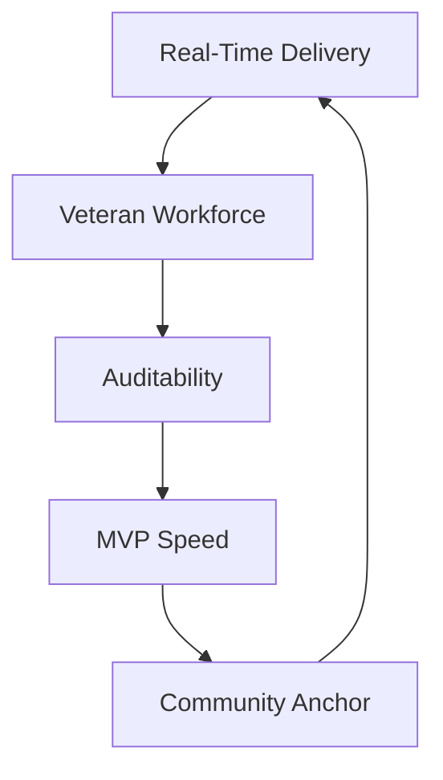
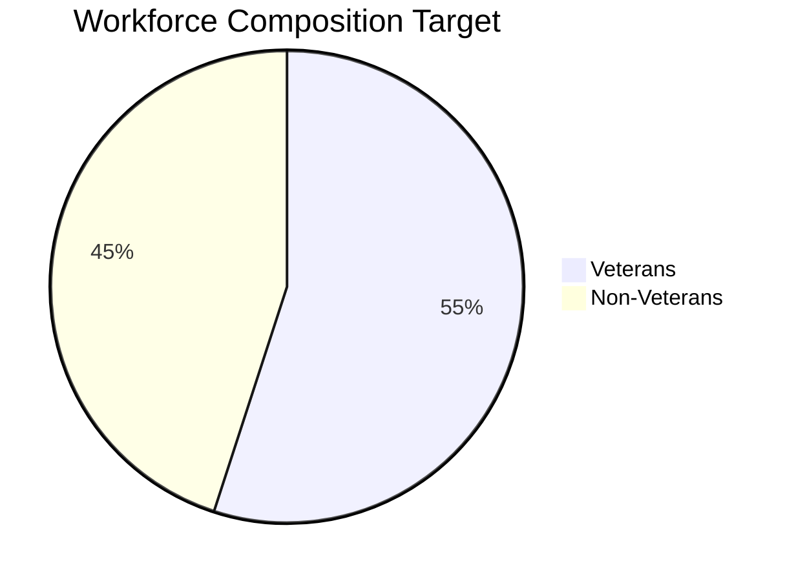

# Capability Statement (Draft)

**Company:** True North Insights

**Location:** Jamestown, North Dakota (Remote-capable, Veteran-led)

**Core Identity:** Legendary solutions. Veteran built. Real-time ready.

## Core Competencies

- Real-time operational dashboards (Forge-Board)
- Time, accountability & activity telemetry (Time-Forge)
- Auditable event trails (Blockchain-enabled prototype)
- Rapid MVP delivery (30–90 day fixed-price engagements)
- Frontend: Angular (Material 3), RxJS hot observables
- Backend: NestJS (primary), emerging Go & Rust microservices

## Differentiators

| Attribute               | True North Insights                | Typical Vendor           |
| ----------------------- | ---------------------------------- | ------------------------ |
| Veteran Workforce Focus | Target 90% veteran employment      | General staffing         |
| Delivery Model          | MVP-first, fixed-price SAT pilots  | Hourly augmentation      |
| Real-Time Pattern       | Observable streaming UI            | Polling / batch refresh  |
| Community Anchor        | ND universities + veteran pipeline | Outsourced / remote only |
| Accountability          | Built-in audit + telemetry design  | Add-on / afterthought    |

### Differentiator Quadrant (Visual)

```mermaid
quadrantChart
    title: Differentiation Field
    x-axis: Commodity Delivery --> High-Efficacy MVP
    y-axis: Detached Workforce --> Integrated Veteran Talent
    quadrant-1: Strategic Edge
    quadrant-2: Talent Opportunity
    quadrant-3: Crowded Middle
    quadrant-4: Legacy Outsourcing
    True North: 0.75, 0.85
    Typical Mid Vendor: 0.35, 0.40
    Offshore Body Shop: 0.20, 0.15
```

### Capability Emphasis Radar (Concept)



## Target Federal Use Cases

- Readiness & logistics visibility (DoD / USACE)
- Compliance & performance auditing (VA / HHS / OMB)
- Incident response dashboards (DHS / FEMA)
- Workforce modernization & training analytics

## NAICS / Codes (Initial Focus)

| NAICS  | Description                     |
| ------ | ------------------------------- |
| 541511 | Custom Computer Programming     |
| 541512 | Computer Systems Design         |
| 541519 | Other Computer Related Services |

(Additional PSC / product codes to be appended in later revision.)

## Partner & Civic Ecosystem (Fraternal / Community Integration)

| Segment                | Examples                  | Intended Value Flow                                   | Activation Mode     |
| ---------------------- | ------------------------- | ----------------------------------------------------- | ------------------- |
| Veteran Service Orgs   | American Legion, VFW, DAV | Cohort recruitment + credibility loop                 | Joint info sessions |
| Civic / Rotary / Lions | Rotary Clubs, Lions Clubs | Local trust + venue + employer signaling              | Sponsored meetups   |
| Disaster / Mission     | Team Rubicon              | Applied project scenarios (logistics, ops dashboards) | Scenario labs       |
| Universities           | NDSU, UND, Jamestown      | Internship & curriculum alignment                     | Capstone alignment  |

**Flywheel:** Community → Talent Cohorts → Delivery Excellence → Proof Assets → Stronger Community Presence.

## Engagement Model

| Stage               | Artifact         | Exit Criteria                 |
| ------------------- | ---------------- | ----------------------------- |
| Discovery (1–2 wks) | Pilot Brief      | Approved scope + fixed price  |
| Build (2–10 wks)    | MVP Increment(s) | Demonstrable feature slice(s) |
| Deploy (1 wk)       | Hardened MVP     | Live environment + training   |
| Extend (ongoing)    | Backlog Roadmap  | Option exercised / follow-on  |

## Past Performance (Foundational / Internal Pilots)

| Project                     | Domain          | Outcome                          |
| --------------------------- | --------------- | -------------------------------- |
| True North Apparel Auditing | Retail / Ledger | Prototype blockchain audit trail |
| Internal Dev Portal         | Productivity    | Real-time metric aggregation     |
| Angular Tactical Interface  | UI / UX         | Deployed modular UI shell        |

## Emerging Workforce Program

- True North Academy (pipeline in design)
- University collaboration (ND-based institutions)
- Rural + veteran distance learning pathway

## Contact

| Role         | Name  | Email                           |
| ------------ | ----- | ------------------------------- |
| Capture Lead | (TBD) | <capture@truenorth.example>     |
| Partnerships | (TBD) | <partners@truenorth.example>    |
| Technical    | (TBD) | <engineering@truenorth.example> |

## Metrics Snapshot (Initial Targets)

| Metric              | Baseline | Target (Q4 2026) | Note                           |
| ------------------- | -------- | ---------------- | ------------------------------ |
| SAT Pilot Awards    | 0        | 3                | At least 1 by first 2 cycles   |
| Subcontract Wins    | 0        | 2                | Through prime analytics niches |
| Veteran Workforce % | (TBD)    | 55%              | Track monthly trend            |
| Cohort Completion % | (TBD)    | 92%              | Via curated curriculum         |
| Time to MVP (days)  | (TBD)    | ≤60              | Reduce risk & cost             |



## Next Enhancement Inserts (Planned)

- Add UEI / CAGE identifiers (post issuance)
- Add SBOM & security posture excerpts
- Add FedRAMP readiness outline (scoped)
- Append NAICS expansion + PSC mapping table
- Link to `security-auditing-backlog.md` for roadmap traceability

> This is a draft; refine with past performance identifiers, UEI/CAGE (once issued), and security posture summary.
