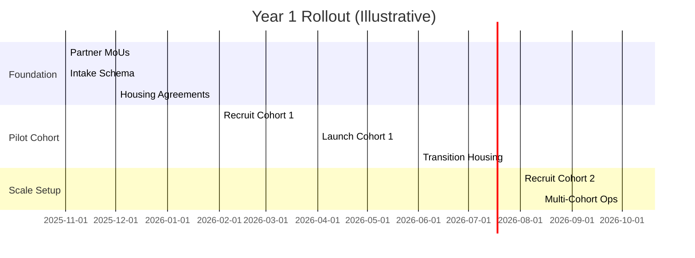
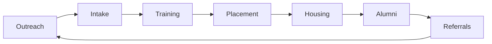
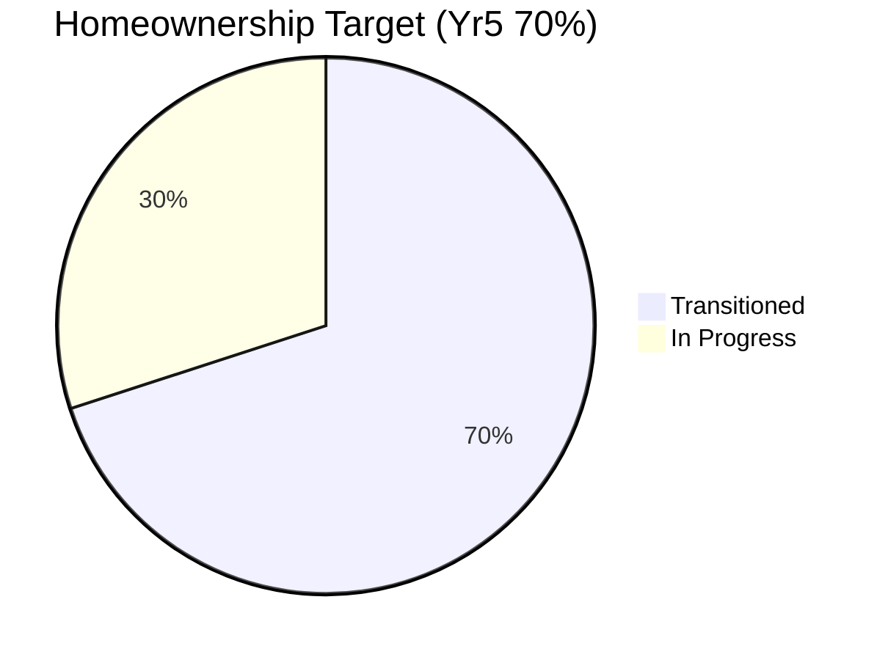

# Jamestown Veteran Relocation Accelerator – One-Pager

Status: Draft v0.1  
Last Updated: 2025-10-03  
Canonical Docs: `move-to-jamestown-veterans.md` (full), `market/veteran/move-to-jametown.md` (grant variant)

---

## Mission Snapshot

Place-based veteran workforce engine combining structured employment, housing stability, and civic integration to create a reproducible rural tech talent model.

## Core Value Stack

| Layer                    | What It Delivers                       | Differentiator               |
| ------------------------ | -------------------------------------- | ---------------------------- |
| Employment Pathway       | Academy → Apprenticeship → Placement   | Measured 90% veteran target  |
| Housing Glidepath        | Transitional → Rental → Ownership      | Retention + family anchoring |
| Civic & Fraternal Mesh   | Elks / Legion / Rotary / VFW / DAV     | Belonging & advocacy loop    |
| Applied Mission Projects | Federal / civic dashboards & telemetry | Proof assets for capture     |
| Transparent KPIs         | Public impact snapshots                | Funders gain verifiable ROI  |

## 12-Month Rollout (Mermaid)



## Program Flywheel



## KPI Trajectory (Targets)

| KPI                        | Y1  | Y3  | Y5  |
| -------------------------- | --- | --- | --- |
| Veterans Relocated         | 10  | 50  | 150 |
| Employment ≤90 Days        | 80% | 85% | 90% |
| Homeownership Transition % | 20% | 45% | 70% |
| Retention (5 yr)           | 70% | 80% | 85% |
| Community Partnerships     | 3   | 6   | 10+ |



## Impact Positioning Grid

```mermaid
quadrantChart
  title: Impact Profile
  x-axis: Generic Talent --> Place-Based Engine
  y-axis: Transactional Output --> Civic & Economic Impact
  quadrant-1: Durable Catalyst
  quadrant-2: Emerging Momentum
  quadrant-3: Undifferentiated
  quadrant-4: Narrow Utility
  Jamestown Accelerator: 0.8, 0.85
  Generic Remote Vendor: 0.35, 0.45
```

## Funding Utilization Slice

| Use                          | % Illustrative | Notes                         |
| ---------------------------- | -------------- | ----------------------------- |
| Stipends & Training Ops      | 30%            | Academy + mentorship costs    |
| Transitional Housing Support | 25%            | Deposits / short-term subsidy |
| Program Staffing & Ops       | 20%            | Coordination + reporting      |
| Tooling & Dashboards         | 10%            | KPI + intake systems          |
| Community / Events           | 10%            | Fraternal & civic integration |
| Reserve / Risk Buffer        | 5%             | Funding continuity            |

## Key Differentiators

- Place-based + housing-backed retention model
- Veteran-centered technical pipeline (measurement-first)
- Civic & fraternal integration = social capital moat
- Transparent KPI & impact reporting from inception

## Immediate Next Actions (90 Day)

| #   | Action                                | ETA      |
| --- | ------------------------------------- | -------- |
| 1   | Finalize intake form & data fields    | Nov 2025 |
| 2   | Execute first housing MoUs            | Dec 2025 |
| 3   | Submit ND Commerce grant application  | Dec 2025 |
| 4   | Build baseline KPI dashboard skeleton | Dec 2025 |
| 5   | Publish public overview web section   | Jan 2026 |

## Contact (Draft)

| Role           | Placeholder Email            |
| -------------- | ---------------------------- |
| Program Lead   | <program@truenorth.example>  |
| Partnerships   | <partners@truenorth.example> |
| Data & Metrics | <data@truenorth.example>     |

---

> One-pager – for briefing, investor, and partner preview. Refer to canonical program doc for governance & risk detail.
