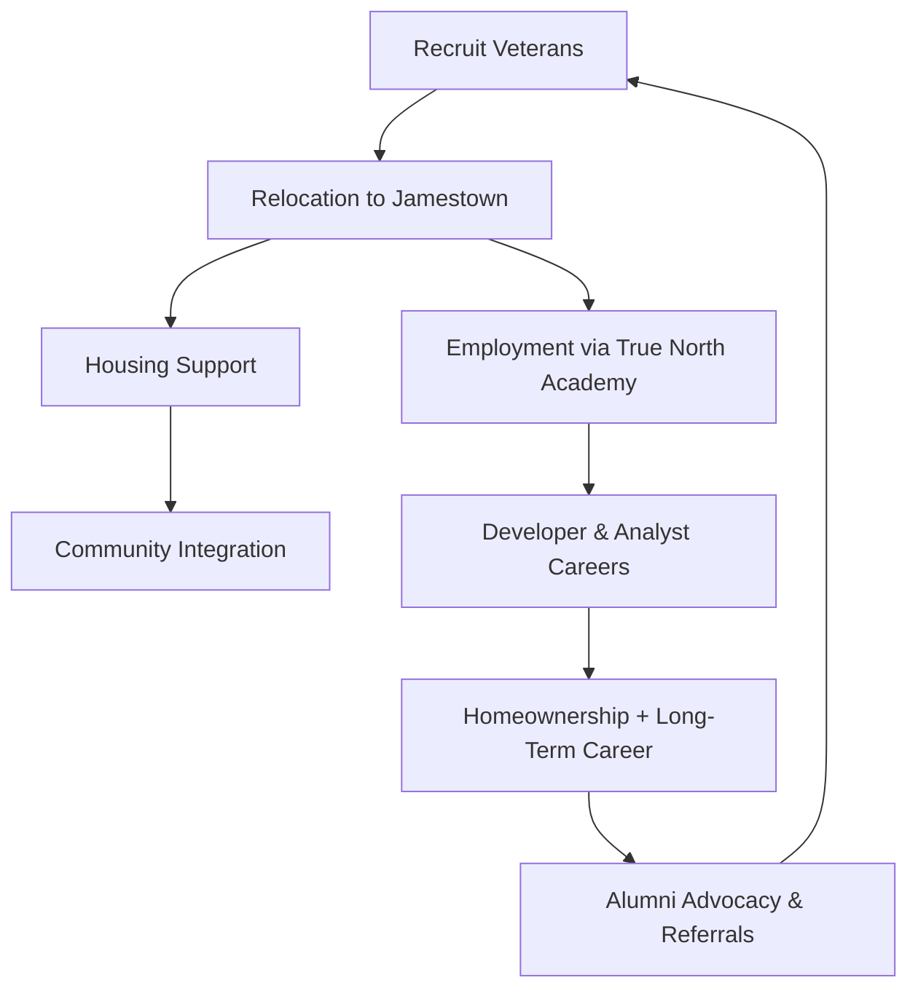
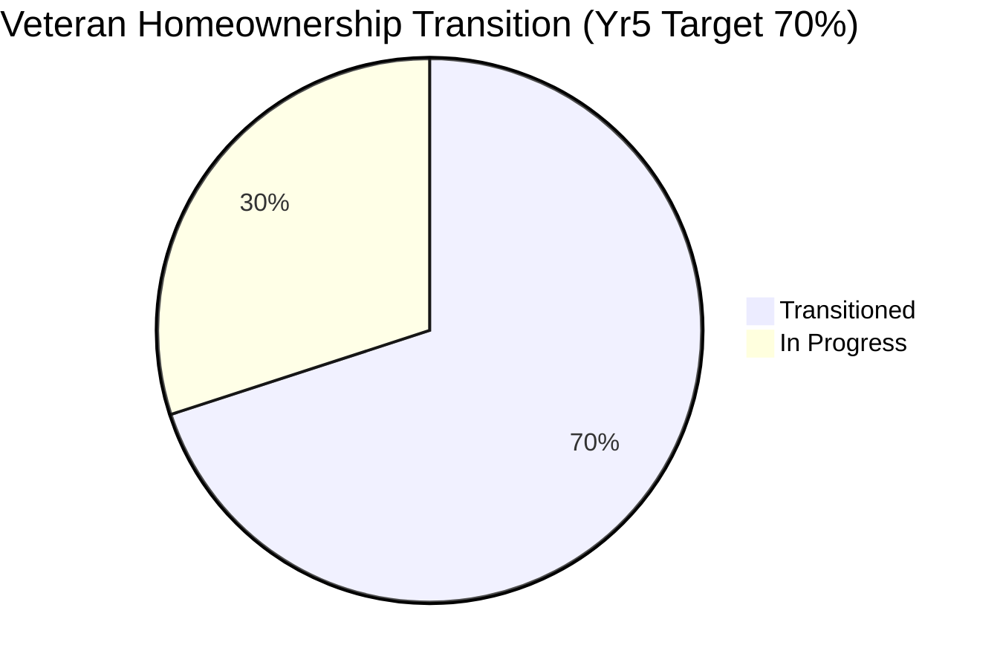
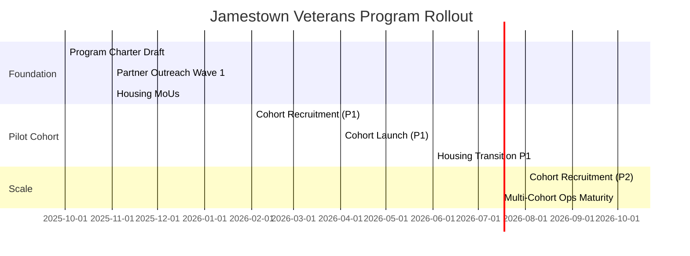

# Move to Jamestown Veterans Program

Workforce • Housing • Community Integration

Status: Draft v1.0  
Last Updated: 2025-10-03

---

## 1. Purpose

The Move to Jamestown Veterans Program is a flagship True North Insights initiative to attract, support, and retain veterans by providing employment opportunities, housing support, and community integration in Jamestown, North Dakota.

This program creates a model for rural revitalization: bringing veterans and their families into a supportive environment where they can thrive professionally and personally, while strengthening the local community.

### Vision Anchors

- 90% veteran workforce participation across True North delivery teams
- Jamestown recognized as a national “Veteran Landing Zone” for tech & analytics
- Rural revitalization through stable, skilled household migration

## 2. Strategic Objectives

| Objective               | Description                                                     | Linked Artifact             |
| ----------------------- | --------------------------------------------------------------- | --------------------------- |
| Workforce Acceleration  | Transition veterans into developer, data, and analytics careers | Veteran Talent Track        |
| Housing Stability       | Reduce relocation friction via structured housing support       | (New) Housing Partner Brief |
| Community Integration   | Embed veterans in civic + fraternal networks                    | Go-To-Market Playbook       |
| Economic Revitalization | Increase local spend, homeownership, and family retention       | 5-Year Marketing Plan       |
| Proof for Funders       | Demonstrate measurable social + economic impact                 | Capability Statement        |

## 3. Program Components

### 3.1 Employment Pathway

1. Lead Capture → Veteran interest form / referral
2. Screening & Skills Assessment (lightweight portfolio / aptitude)
3. Enrollment in True North Academy (Veteran Talent Track)
4. Mentorship → Apprenticeship (shadow + structured sprint)
5. Full-Time Developer / Analyst placement
6. Progression to Senior / Lead roles (technical or delivery)

### 3.2 Housing Support

| Phase         | Support Mechanism                             | Duration | Partners                             |
| ------------- | --------------------------------------------- | -------- | ------------------------------------ |
| Arrival       | Transitional furnished housing / dorm cluster | 0–3 mo   | Housing Authority / Local Devs       |
| Stabilization | Discounted rental w/ program MOU              | 3–12 mo  | Banks / Property Managers            |
| Growth        | Financial literacy + VA loan navigation       | 6–18 mo  | Lenders / ND Housing Finance         |
| Anchor        | Homeownership & equity build                  | 12–36 mo | Local Real Estate / State Incentives |

### 3.3 Community Integration

- Sponsored welcome events (Elks, Legion, Lions, Rotary, VFW, DAV, Masons, Team Rubicon)
- Monthly Jamestown Coding Meetup (training + community showcase)
- Family-friendly seasonal events (winter resilience, summer innovation fair)
- Civic service projects (data infrastructure for local nonprofits / schools)

### 3.4 Support Services (Future Wave)

| Service                      | Description                                  | Trigger             |
| ---------------------------- | -------------------------------------------- | ------------------- |
| Mental Health Navigation     | Warm hand-offs to vetted providers           | Intake              |
| Career Coaching              | Quarterly progression reviews                | Post-apprenticeship |
| Entrepreneur Track (Stretch) | Startup incubation path for veteran founders | Alumni stage        |

## 4. Program Flow (Visual)

## 5. Partnerships & Ecosystem

| Segment            | Examples                                      | Value Provided                            | Activation Mode           |
| ------------------ | --------------------------------------------- | ----------------------------------------- | ------------------------- |
| State Incentives   | ND Commerce                                   | Workforce & relocation grants             | Formal proposal           |
| Local Government   | Jamestown City / County Dev Corp.             | Zoning, site support                      | MOU + council brief       |
| Universities       | UND, NDSU, University of Jamestown            | Continuing education + capstones          | Joint curriculum          |
| Fraternal & Civic  | Legion, VFW, Elks, Masons, Rotary, Lions, DAV | Social anchor & retention                 | Sponsored events          |
| Mission / Response | Team Rubicon                                  | Applied ops projects                      | Scenario labs             |
| Employers / Primes | ND tech & defense contractors                 | Shared placement pipeline                 | Talent sharing agreements |
| Housing & Finance  | Banks, Developers, ND Housing Finance         | Transitional & permanent housing pathways | Financing stack           |

## 6. Incentive Framework

| Incentive                  | Beneficiary      | Mechanism                        | Notes                      |
| -------------------------- | ---------------- | -------------------------------- | -------------------------- |
| Relocation Stipend (Pilot) | Veteran          | Lump sum or staged reimbursement | Pilot cohort only          |
| Housing Deposit Bridge     | Veteran          | Program-backed guarantee         | Requires reserve fund      |
| Training Cost Absorption   | Veteran          | Academy tuition covered          | In exchange for commitment |
| Employer Cost Offset       | Partner Employer | Wage subsidy (initial months)    | Grant-backed               |
| Community Service Credit   | Veteran          | Recognition / portfolio artifact | Ties to civic projects     |

## 7. Success Metrics

| Metric                     | Year 1 Target | Year 3 Target | Year 5 Target | Measurement Source       |
| -------------------------- | ------------- | ------------- | ------------- | ------------------------ |
| Veterans Relocated         | 10            | 50            | 150           | Intake registry          |
| % Employed ≤90 Days        | 80%           | 85%           | 90%           | HR placement tracking    |
| Homeownership Transition % | 20%           | 45%           | 70%           | Housing partner reports  |
| Retention in ND (5 yrs)    | 70%           | 80%           | 85%           | Longitudinal alumni file |
| Community Partnerships     | 3             | 6             | 10+           | MOU ledger               |
| Alumni Referral Rate       | (baseline)    | 15%           | 25%           | CRM tagging              |

## 8. Operating Cadence

| Cadence   | Activity                      | Owner                 | Artifact          |
| --------- | ----------------------------- | --------------------- | ----------------- |
| Weekly    | Intake review & pipeline sync | Talent Lead           | Intake dashboard  |
| Bi-Weekly | Housing availability refresh  | Housing Liaison       | Housing roster    |
| Monthly   | Community event / meetup      | Community Coordinator | Event recap       |
| Quarterly | Partner review & KPI audit    | Program Director      | Quarterly report  |
| Annual    | Strategic impact brief        | Executive Sponsor     | Impact whitepaper |

## 9. Governance & Compliance

- Data privacy for veteran records (align with security & auditing backlog)
- Transparent selection criteria (publish summary)
- Periodic equity audits (demographic fairness)
- Risk register (housing capacity, funding gaps, retention risk)

## 10. Funding & Sustainability (Draft Model)

| Stream             | Source                          | Notes                      |
| ------------------ | ------------------------------- | -------------------------- |
| Grants             | ND Commerce / Federal workforce | Seed operating costs       |
| Philanthropy       | Fraternal + civic sponsorships  | Event + stipend support    |
| Operational Margin | True North delivery engagements | Reinvest % to program      |
| Education Credits  | University partnerships         | Cost sharing               |
| Housing Incentives | State & lenders                 | Lower barrier to ownership |

## 11. Integration Points

| Artifact                    | Linkage                        | Value Added               |
| --------------------------- | ------------------------------ | ------------------------- |
| Go-To-Market Playbook       | Adds relocation accelerator    | Capture & brand narrative |
| Veteran Talent Track        | Cohort ingestion & progression | Skill maturation          |
| Capability Statement        | Place-based differentiation    | Funding credibility       |
| Security & Auditing Backlog | Governance hooks               | Compliance posture        |
| Outreach Cadence            | Monthly anchor event           | Consistency loop          |

## 12. Risk & Mitigation Snapshot

| Risk                           | Impact                  | Likelihood | Mitigation                          |
| ------------------------------ | ----------------------- | ---------- | ----------------------------------- |
| Insufficient Housing Inventory | Program throttling      | Medium     | Early MoUs + staged cohorts         |
| Funding Gap (Year 2)           | Scale slowdown          | Medium     | Diversify streams early             |
| Retention Drop Post-Year 1     | Weak long-term outcomes | Low/Med    | Structured mentorship + alumni loop |
| Veteran Burnout                | Attrition               | Medium     | Mental health navigation + pacing   |
| Partner Fatigue                | Event quality decline   | Low        | Rotational sponsorship calendar     |

## 13. Roadmap (High-Level Gantt)

## 14. Next Actions (Initial)

| #   | Action                                   | Owner                 | ETA      | Effort (d) | Notes                          |
| --- | ---------------------------------------- | --------------------- | -------- | ---------- | ------------------------------ |
| 1   | Validate housing partner interest list   | Program Director      | Nov 2025 | 1          | Outreach emails + MoU draft    |
| 2   | Draft intake form schema                 | Talent Lead           | Nov 2025 | 0.5        | Data fields + validation rules |
| 3   | Prepare relocation stipend funding brief | Finance               | Nov 2025 | 0.75       | Budget model + narrative       |
| 4   | Secure fraternal event calendar Q1–Q2    | Community Coordinator | Dec 2025 | 1          | 6-month cadence locked         |
| 5   | Create KPI baseline dashboard view       | Data Lead             | Dec 2025 | 1.5        | Initial metrics wiring         |

## 15. Appendix

- To be expanded with: intake form schema, housing partner roster, funding application templates, and alumni testimonial formats.

---

> Draft – for internal circulation and partner preview. Submit revisions via tracked change PRs.
