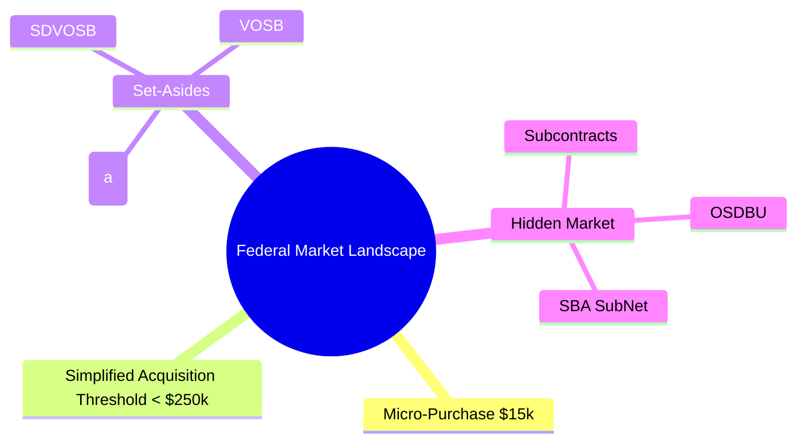
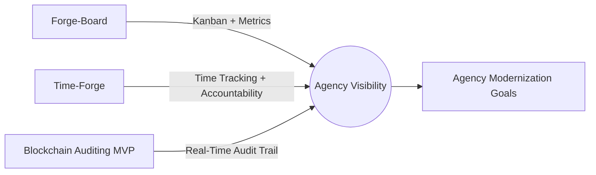
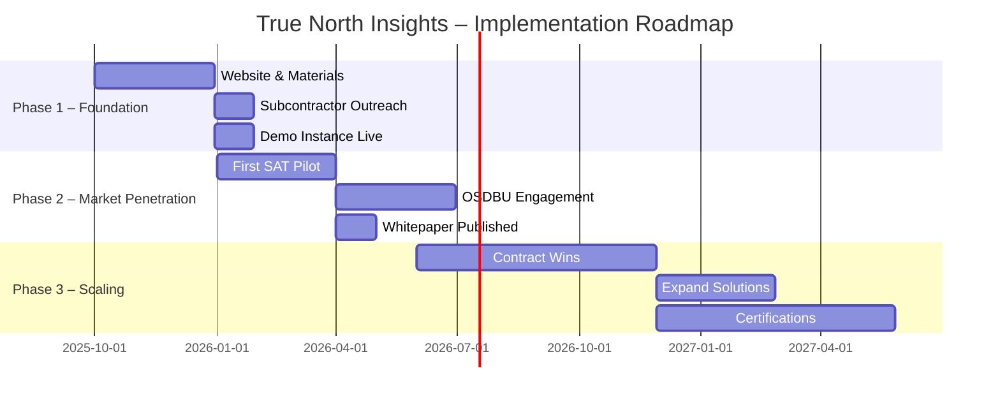

# True North Insights – 5 Page Marketing Plan

---

## Page 1 – Executive Summary

**Who We Are**  
True North Insights is a veteran-led, pro-American technology and consulting company based in Jamestown, North Dakota. Our mission is simple: *We are legendary* — delivering secure, innovative, real-time solutions to government and defense partners under $250K contracts, where speed, accountability, and value matter most.

### Core Value Proposition

- Veteran-led, small business preference for federal contracting.  
- Specialized in **real-time data visualization**, **Forge-Board (Kanban + metrics)**, and **Time-Forge (time tracking + accountability)**.  
- Agile enough for **micro-purchases ($15k)** and **Simplified Acquisition Threshold contracts** (recently raised above $250k).  
- Transparent, patriotic branding and a focus on accountability — aligning with agencies’ modernization and compliance missions.

---

## Page 2 – Market Analysis

### Federal Opportunity Landscape

- **Micro-purchase ($15k)** and **SAT (<$250k)** buys are fast-track awards. Agencies use them for modernization pilots and proofs of concept.  
- **Set-aside programs (SDVOSB, VOSB, 8(a))** allow sole-source awards up to several million. Even without certifications yet, agencies *must* consider small business set-asides for buys above SAT.  
- **Hidden subcontracting market**: Most opportunities never hit SAM.gov. Prime contractors with subcontracting plans are required to bring in small businesses — a huge pipeline for us.  

### Target Agencies

- **USACE / DoD**: modernization pilots, dashboarding, data governance.  
- **VA / HHS**: real-time auditing, compliance reporting.  
- **OMB / GAO**: performance dashboards, auditing tools.  
- **Homeland Security / FEMA**: rapid data visualization, incident response dashboards.  

### Competitive Advantage

- Many small vendors offer dev services. True North Insights distinguishes itself by:  
  - Veteran-led brand with patriotic, pro-accountability ethos.  
  - Tight focus on **real-time, observable dashboards**.  
  - Ability to deliver **MVP pilots in 30–90 days** at fixed-price.  

---

## Page 3 – Capabilities & Offerings

### Core Platforms

- **Forge-Board** – real-time Kanban + metrics aligned to SAFe/Agile. Enables agencies to visualize tasks, performance, and timelines in one place.  
- **Time-Forge** – AI-ready time tracking + accountability system. Fits well with federal reporting and performance audits.  
- **Blockchain-backed Auditing MVP** – real-time audit trail of transactions (pilot first in True North Apparel, exportable to federal use cases).  

### Technology Stack

- Angular 19/20 + Material Design 3 Expressive (frontend) with **legendary tactical interface**.  
- Traditional NgModule architecture with constructor DI patterns for enterprise reliability.
- **Hot Observable patterns** with RxJS shareReplay(1) for real-time performance.  
- **Military-grade tactical UI** with step-by-step user feedback and comprehensive audit logging.
- NestJS, Go, Rust (backend microservices).  
- MongoDB + PostgreSQL dual persistence (planned).  
- Secure, local deployments with PM2/Nginx — FedRAMP-aligned architecture.

### Navigation Architecture Vision

- **Multi-level pancake navigation**: True North → True North Insights → Feature Tabs
- **Icon-driven router system** with tab groups at enterprise level
- **Scalable abstraction layers** from product overview to detailed specifications  

### Service Model

- 30–90 day **fixed-price MVP deployments**.  
- **White-label dashboards** agencies can extend internally.  
- **Direct prime contracts** under SAT.  
- **Subcontracts** to primes needing fast modernization wins.  

---

## Page 4 – Marketing & Outreach Strategy

### Brand Positioning

- “Legendary Solutions. Veteran Built. Real-Time Ready.”  
- Red, white, and blue theme, patriotic visual branding.  
- Appeals to both agency decision-makers and prime contractor liaisons.  

### Channels

1. **Website (True North Insights)**  
   - Professional, patriotic, modern design.  
   - Clear CTAs: “Request a Pilot,” “Capability Statement Download.”  
   - Forge-Board/Time-Forge demo videos.  

2. **Agency OSDBU Engagement**  
   - Submit capability statements to target OSDBUs (USACE, VA, DHS).  
   - Attend agency small business outreach events.  

3. **Prime Contractor Subcontracting Outreach**  
   - Build a **list of 20 primes** with federal dashboards/modernization contracts.  
   - Direct email + call campaign with one-pager and short demo reel.  

4. **SAM.gov / SubNet Monitoring**  
   - Weekly scan for <SAT solicitations.  
   - Quick-turn proposals using boilerplate templates.  

### Messaging Themes

- Real-time visibility = accountability.  
- Veteran-led = trust and commitment.  
- Rapid MVP = lower risk for agencies.  

---

## Page 5 – Implementation Roadmap

**Phase 1 – Foundation (0–3 months) ✅ IN PROGRESS**  

- ✅ **Legendary tactical interface deployed** with Material 3 Expressive design
- ✅ **Enterprise notification system** with step-by-step user feedback  
- ✅ **Comprehensive audit logging** with observable patterns
- ✅ **Traditional Angular architecture** established for enterprise reliability
- 🔄 **Navigation architecture planning** - multi-level pancake system design
- 📋 Launch **True North Insights website** (developer + business audience)  
- 📋 Finalize **one-page capability statement** and outreach materials  
- 📋 Begin **direct subcontractor outreach** (target: 20 primes)  

**Phase 2 – Market Penetration (3–6 months)**  

- Pursue **first SAT pilot award (<$250k)**.  
- Attend **2–3 OSDBU small business outreach events**.  
- Publish whitepaper: “Real-Time Auditing for Federal Modernization.”  

**Phase 3 – Scaling (6–12 months)**  

- Win at least **2 prime contracts + 2 subcontracts**.  
- Expand Forge-Board/Time-Forge into agency-specific solutions.  
- Explore **8(a) or SDVOSB certifications** to open larger sole-source channels.  

