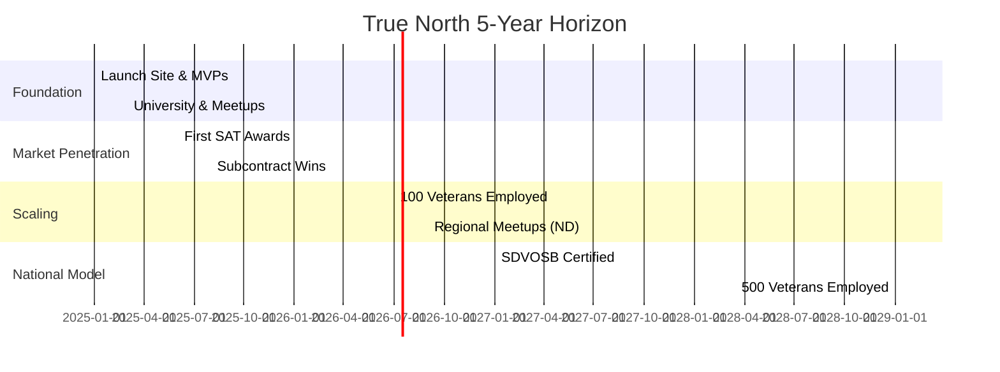
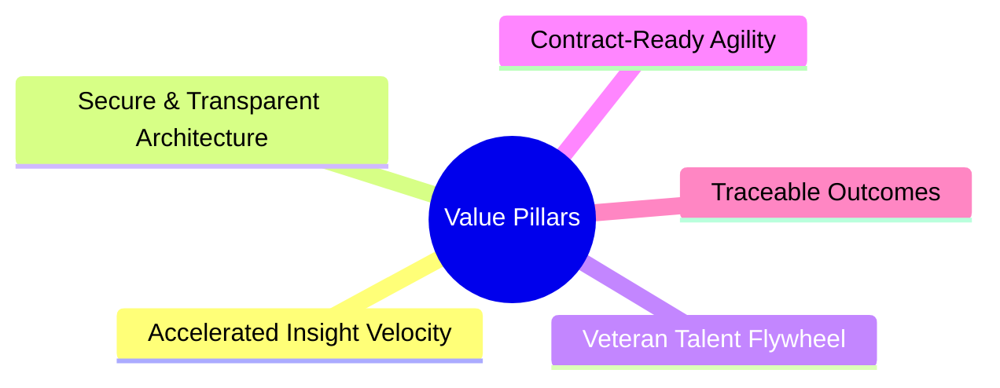
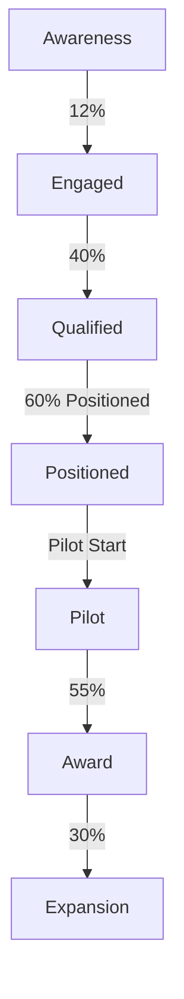
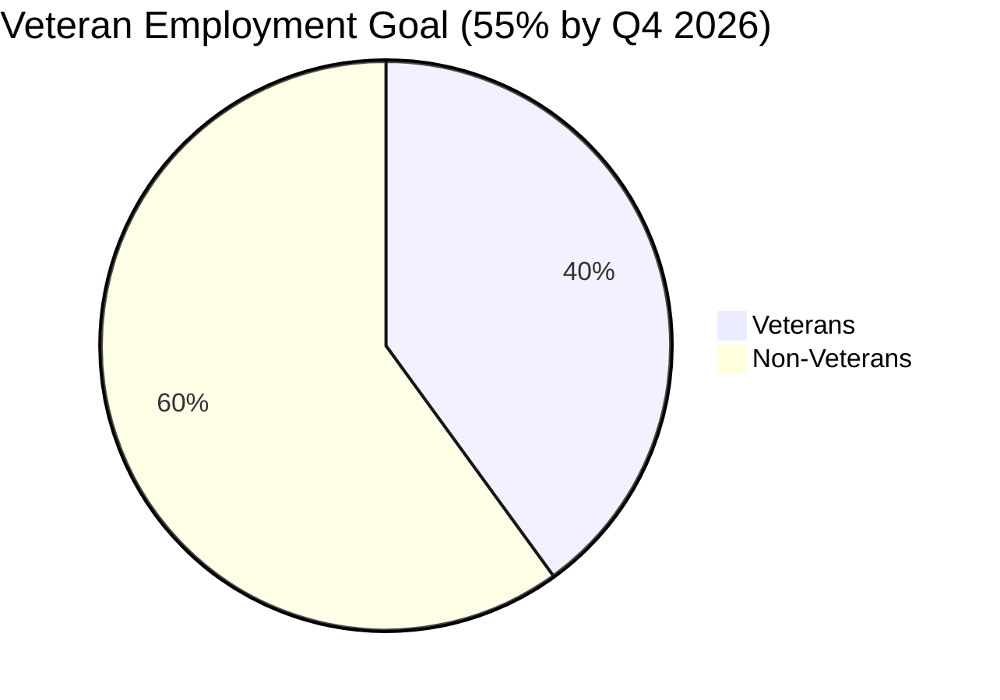
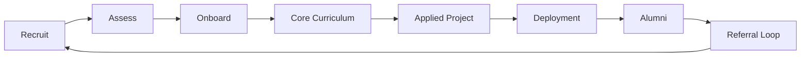
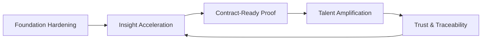
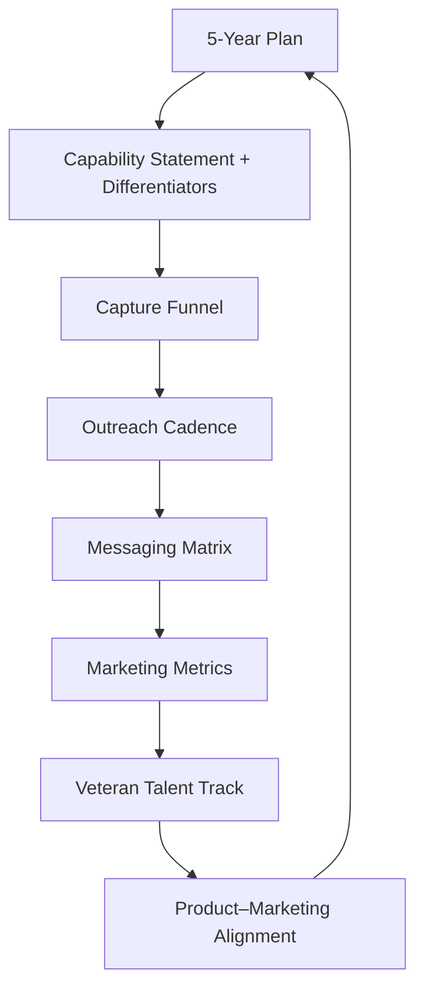

# True North Insights – Go-To-Market Playbook

Status: Draft (Expanded)  
Last Updated: 2025-10-03 (Community & Visual Enhancements)

---

## 1. Vision & Mission (Strategic Horizon)

Source: `5-year-marketting-plan.md`

**Mission:** Become America’s Veteran Tech Company — legendary solutions, veteran-built, real-time ready.

### Core Axes

- Real-time systems (Forge-Board, Time-Forge, Blockchain Auditing)
- Veteran workforce (90% veteran employment, True North Academy)
- Federal contracting growth (Micro-purchase, SAT awards, set-asides)
- Community & fraternal impact (ND universities, meetups, distance learning, Elks, Legion, VFW, Rotary, Lions, DAV, Team Rubicon)

#### 5-Year Horizon (Visual)



## 2. Positioning & Differentiation

Source: Capability Statement (future doc) & Product–Marketing Alignment

### Differentiators

1. Veteran workforce focus (90% target)
2. MVP-first, fixed-price SAT pilots
3. Observable, real-time dashboards (vs. batch reports)
4. Anchored in North Dakota (local trust + national scale)

### Value Pillars



- Accelerated Insight Velocity
- Secure & Transparent Architecture
- Veteran Talent Flywheel
- Contract-Ready Agility
- Traceable Outcomes

## 3. Federal Capture System

Source: Capture Funnel

### Stages & Gate Criteria

| Stage                | Definition                     | Entry Signal                     | Exit / Promotion                          | Primary KPI            |
| -------------------- | ------------------------------ | -------------------------------- | ----------------------------------------- | ---------------------- |
| 1. Awareness         | Target knows of us             | Initial touch / view             | Engagement reply                          | Awareness→Engaged %    |
| 2. Engaged           | Two-way dialog open            | Reply / meeting booked           | Qualification discovery done              | Engaged→Qualified %    |
| 3. Qualified         | Mission + vehicle matched      | Discovery notes + vehicle path   | Capture positioning assets packaged       | Qualified→Positioned % |
| 4. Positioned        | We have a tailored pilot frame | Pilot outline + value hypothesis | Pilot kickoff confirmed                   | Pilot Start Rate       |
| 5. Pilot             | Active scoped MVP delivery     | Kickoff executed                 | Pilot success review + next award request | Pilot→Award %          |
| 6. Award / Expansion | Contract / recurring value     | Award executed                   | Expansion path logged                     | Expansion Rate         |

### Conversion Targets & Funnel



- Awareness→Engaged: 12%
- Engaged→Qualified: 40%
- Qualified→Positioned: 60%
- Pilot→Award: 55%
- Award→Expansion: 30%

### Tooling Enablers

- CRM stage fields + workflow triggers
- Automated “pilot success” summary template
- Playbook snippet library for responses

## 4. Outreach Rhythm

Source: Outreach Cadence

### Weekly Operating Rhythm

```mermaid
gantt
  title Weekly Outreach Rhythm (Rolling)
  dateFormat  ddd
  section Weekly Ops
  Mon :active, mon, 1d
  Tue :tue, 1d
  Wed :wed, 1d
  Thu :thu, 1d
  Fri :fri, 1d
```

| Day | Focus                | Anchor Activity                 | Logged Asset              |
| --- | -------------------- | ------------------------------- | ------------------------- |
| Mon | Federal reach-outs   | Targeted micro-purchase angle   | Outreach log              |
| Tue | Prime introductions  | Prime matrix update             | Partner sheet delta       |
| Wed | Veteran cohort touch | Talent pipeline sync            | Cohort dashboard snapshot |
| Thu | Capability briefing  | Briefing deck revision          | Versioned deck ID         |
| Fri | Metrics review       | KPI trend check + atomize 1 win | Atomized snippet link     |

### Monthly / Quarterly Layers

- Webinars & joint prime sessions
- Whitepaper & technical deep-dive releases
- ND talent + university engagement set

_Principle: Consistency > Intensity. Every touch logged. Every asset atomized._

## 5. Messaging Framework

Source: Messaging Matrix

### Personas Covered

VA Program Execs · Contracting Specialists · Prime Capture Leads · Technical Leads · Security Reviewers · University Leads · Veteran Partners · Operational Champions

### Persona Data Model

- Pain Themes
- Positioning Handle
- Proof Assets
- CTA

### Cross-Persona Pillars

Accelerated insight · Secure architecture · Veteran flywheel · Contract-ready agility · Traceable outcomes

### Fraternal & Civic Persona (Added)

| Aspect      | Detail                                                                                                      |
| ----------- | ----------------------------------------------------------------------------------------------------------- |
| Pain        | Underutilized veteran technical potential; desire for visible impact                                        |
| Positioning | True North converts service discipline into high-signal analytics delivery for federal + community outcomes |
| Proof       | Talent Track metrics, cohort project demos, community hackathon outputs                                     |
| CTA         | Co-sponsor academy cohort / host meetup / scholarship fund                                                  |

## 6. Metrics & Accountability

Source: Marketing Metrics

### Core KPIs (Targets by Q4 2026)

| KPI                   | Current (Baseline Placeholder) | Target | Notes                                      |
| --------------------- | ------------------------------ | ------ | ------------------------------------------ |
| SAT pilot awards      | 0                              | 3      | At least 1 within first 2 cycles           |
| Subcontract wins      | 0                              | 2      | Via primes needing veteran analytics niche |
| Veteran employment %  | (TBD)                          | 55%    | Track monthly; target 40% mid-year         |
| Universities engaged  | 0                              | 3      | NDSU, UND, Jamestown U candidates          |
| Inbound leads / month | 0                              | 12     | Blend OSDBU + fraternal + webinars         |
| Demo conversion rate  | 0                              | 40%    | After messaging refinement                 |



### Review Cadence

- Monthly metric review
- Quarterly KPI refresh

### Leading Indicators

- Slow pilot acquisition (<1 lead/mo)
- Veteran hiring lag (<30% after 2 hires)

## 7. Veteran Talent Flywheel

Source: Veteran Talent Track

### Cohort Lifecycle (Flywheel)

Recruit → Assess → Onboard → Core Curriculum → Applied Project → Deployment → Alumni → Referrals → New Cohorts



### Curriculum Modules

Data foundations · Secure handling · Lineage · Analytics · API contracts · Mission sprint

### Talent Metrics

| Metric               | Current → Target |
| -------------------- | ---------------- |
| Ramp time            | 30 → 24 days     |
| Cohort completion    | 85% → 92%        |
| Promotion ≤12 mo     | 15% → 25%        |
| Alumni referral rate | 10% → 20%        |

### Integration with GTM

Cohort projects become anonymized proof artifacts; alumni featured in capability briefings.

## 8. Product–Marketing Synchronization

Source: Product–Marketing Alignment

| Capability                   | Pillar Link                             |
| ---------------------------- | --------------------------------------- |
| Dual Persistence Layer       | Secure & Transparent / Insight Velocity |
| Transformation Lineage Graph | Traceable Outcomes                      |
| Veteran Academy Integration  | Veteran Flywheel                        |

### Roadmap Theme Clusters

Foundation hardening · Insight acceleration · Contract-ready proof · Talent amplification · Trust & traceability



### KPI Links

Mean time to first insight · Reproducibility rate · Veteran ramp time · Pilot success cycle

## 9. Governance & Index

Source: README / Documentation Index

### Cadence Ownership Matrix

| Artifact             | Frequency   | Status Legend                        |
| -------------------- | ----------- | ------------------------------------ |
| Capability Statement | Monthly     | Draft / Active / Revision / Archived |
| Messaging Matrix     | Quarterly   | Draft / Active / Revision / Archived |
| 5-Year Plan          | Semi-Annual | Draft / Active / Revision / Archived |
| Talent Track         | Quarterly   | Draft / Active / Revision / Archived |

### Backlog Additions

- NAICS + PSC code expansion
- FedRAMP / security posture summary
- Metrics automation integration

---

## Visual Map of the Playbook



## Appendix

Cross-links: `5-year-marketting-plan.md`, `product-marketing-alignment.md`, `messaging-matrix.md`, `marketing-metrics.md`, `veteran-talent-track.md`, `capture-funnel.md`, `outreach-cadence.md`.

Additional Programs: `move-to-jamestown-veterans.md` (Veteran Relocation Accelerator), `design/tasks-backlog.md` (Design & Experience Backlog).

### Veteran Relocation Accelerator (Excerpt)

Strategic add-on initiative: Move-to-Jamestown program integrates workforce (Talent Track), housing stabilization, and civic/fraternal onboarding to reinforce retention and differentiate capability posture. See `move-to-jamestown-veterans.md` for full KPI table, partnership matrix, and rollout Gantt.

---

## Pending Task Backlog (Derived from Enhancements)

| ID     | Task                                        | Category    | Rationale                  | Effort (d) |
| ------ | ------------------------------------------- | ----------- | -------------------------- | ---------- |
| GTM-1  | Add source-map bundle analysis script       | Performance | Support budget tuning      | 0.5        |
| GTM-2  | Re-enable modern Material theme API         | Theming     | Consistent design tokens   | 1          |
| GTM-3  | Implement `@defer` on non-critical sections | Performance | Reduce initial bundle      | 0.5        |
| GTM-4  | Add analytics service scaffold              | Insights    | Track funnel nav & CTA     | 0.5        |
| GTM-5  | Add a11y automated axe scan script          | Quality     | Guard regressions          | 0.5        |
| GTM-6  | Create fraternal partner outreach kit       | Community   | Accelerate network growth  | 1          |
| GTM-7  | Metrics dashboard automation (export)       | Ops         | Reduce manual compilation  | 1          |
| GTM-8  | Talent Track dashboard (ramp metrics)       | Talent      | Real-time program health   | 1.5        |
| GTM-9  | Add OpenAPI auth scopes placeholders        | API         | Prep for security layering | 0.5        |
| GTM-10 | Implement route-based preloading strategy   | Performance | Improve perceived nav      | 0.5        |

_Note: Security & auditing tasks tracked separately in `security-auditing-backlog.md`._
