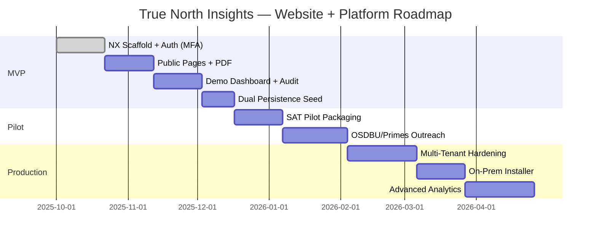

# Roadmap — From MVP to Production

**Phase 1 Foundation COMPLETED ✅ October 1, 2025**  

- Legendary tactical interface with Material 3 Expressive
- Enterprise notification system and comprehensive logging
- Traditional Angular architecture established
- Commit: 605b035

**Acceptance (MVP):**

- Public site live (Home, Solutions, Security, Case Studies, Contact).
- Capability PDF downloadable.
- Login with MFA; demo dashboard; audit log visible.
- Seeded data present **in both** Mongo and SQL.
